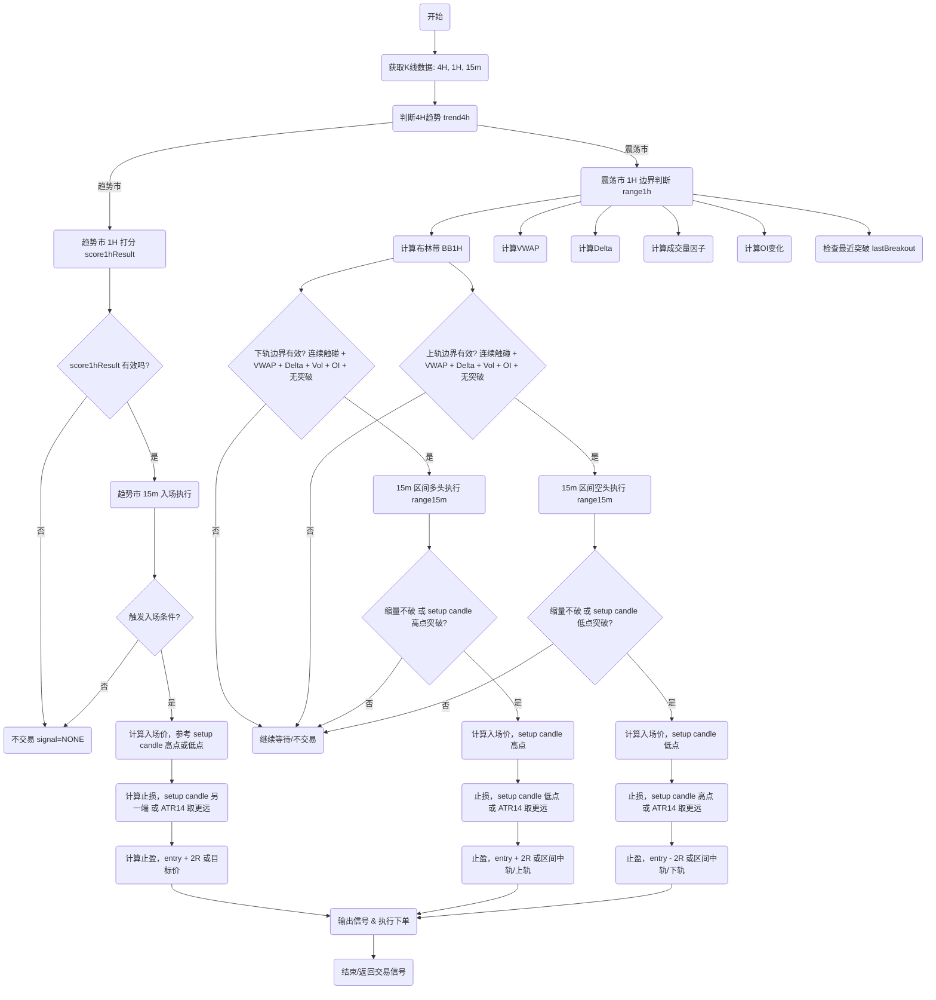

# 趋势交易策略-V3

# **1. 时间框架设计**

- 趋势过滤（4H） → 判断大方向（多头趋势市/空头趋势市/震荡市）。
- 趋势确认（1H） → 多因子打分机制，验证趋势有效性。
- 入场执行（15m） → 精确择时，设置止盈止损。

# **2. 策略逻辑分层**

**🔹 2.1 4H 趋势过滤**

- 多头趋势条件：
    - MA20 > MA50 > MA200
    - 收盘价 > MA20
- 空头趋势条件：
    - MA20 < MA50 < MA200
    - 收盘价 < MA20
- 额外过滤：ADX(14) > 20 且布林带带宽扩张（趋势强度确认）。
- 连续确认机制：
    - 至少 2 根 4H K 线（≈8 小时）满足趋势市条件 → 判定趋势市成立。
    - 否则判定为震荡市。
- 输出：trend4h = "多头趋势" | "空头趋势" | "震荡市"

**🔹 2.2 多头趋势｜空头趋势 统称为趋势市，还需要1H多因子打分确认和15分钟入场执行确认止盈止损后才会开始交易。**

- **2.2.1 1H 多因子打分确认（score ≥3 才有效）**
    1. VWAP 方向一致（必须满足）
        - 多头：收盘价 > VWAP
        - 空头：收盘价 < VWAP
    2. 突破确认
        - 多头：收盘价突破最近 20 根 4H K线高点
        - 空头：收盘价跌破最近 20 根 4H K线低点
    3. 成交量双确认
        - 15m 成交量 ≥ 1.5 × 20期均量
        - 1h 成交量 ≥ 1.2 × 20期均量
    4. OI（未平仓合约量）变化
        - 多头：6h OI ≥ +2%
        - 空头：6h OI ≤ -3%
    5. 资金费率
        - 0.05% ≤ Funding Rate ≤ +0.05%
    6. Delta/买卖盘不平衡
        - 多头：主动买盘 ≥ 卖盘 × 1.2
        - 空头：主动卖盘 ≥ 买盘 × 1.2

趋势市和震荡市的判断逻辑实现：

```jsx
/**
 * detectTrendMarket.js
 * 完整趋势市 + 震荡市判断（优化版）
 * 输入：
 *  - candles4h: 4H K线数组 [{high, low, close, volume}]
 *  - candles1h: 1H K线数组 [{high, low, close, volume, vwap, oiChange, fundingRate, delta}]
 *  - options: 1H 多因子阈值 {volMultiplier, oiChange, fundingRateMax, deltaThreshold}
 * 输出：
 *  - { trend4h: "LONG"|"SHORT"|"NONE", score1h: number, entryAllowed: true|false, isRanging: true|false }
 */

function calculateMA(candles, period = 20) {
  return candles.map((c, i) => {
    if (i < period - 1) return null;
    const sum = candles.slice(i - period + 1, i + 1).reduce((acc, x) => acc + x.close, 0);
    return sum / period;
  });
}

function calculateADX(candles, period = 14) {
  if (!candles || candles.length < period + 1) return null;

  const TR = [], DMplus = [], DMminus = [];
  for (let i = 1; i < candles.length; i++) {
    const high = candles[i].high, low = candles[i].low, closePrev = candles[i-1].close;
    const highPrev = candles[i-1].high, lowPrev = candles[i-1].low;

    const tr = Math.max(high - low, Math.abs(high - closePrev), Math.abs(low - closePrev));
    TR.push(tr);

    const upMove = high - highPrev;
    const downMove = lowPrev - low;

    DMplus.push(upMove > downMove && upMove > 0 ? upMove : 0);
    DMminus.push(downMove > upMove && downMove > 0 ? downMove : 0);
  }

  function smooth(arr) {
    const smoothed = [];
    let sum = arr.slice(0, period).reduce((a,b)=>a+b,0);
    smoothed[period-1] = sum;
    for(let i=period;i<arr.length;i++){
      sum = smoothed[i-1] - smoothed[i-1]/period + arr[i];
      smoothed[i] = sum;
    }
    return smoothed;
  }

  const smTR = smooth(TR), smDMplus = smooth(DMplus), smDMminus = smooth(DMminus);
  const DIplus = smDMplus.map((v,i)=> i>=period-1 ? 100*v/smTR[i]: null);
  const DIminus = smDMminus.map((v,i)=> i>=period-1 ? 100*v/smTR[i]: null);
  const DX = DIplus.map((v,i)=> i<period-1? null : 100*Math.abs(DIplus[i]-DIminus[i])/(DIplus[i]+DIminus[i]));
  const ADX = [];
  let sumDX = DX.slice(period-1, period-1+period).reduce((a,b)=>a+b,0);
  ADX[period*2-2] = sumDX/period;
  for(let i=period*2-1;i<DX.length;i++){
    ADX[i] = (ADX[i-1]*(period-1)+DX[i])/period;
  }
  const last = ADX.length-1;
  return { ADX: ADX[last]||null, DIplus: DIplus[last]||null, DIminus: DIminus[last]||null };
}

/**
 * 计算1H多因子打分（优化版）
 * VWAP方向必须一致，否则返回0
 * 其他因子只加分，不减分
 */
function score1h(candles1h, trend4h, options){
  if(candles1h.length<20) return 0;
  const last = candles1h[candles1h.length-1];

  // 强制VWAP方向一致
  if(trend4h==="LONG" && last.close <= last.vwap) return 0;
  if(trend4h==="SHORT" && last.close >= last.vwap) return 0;

  let score = 0;

  // 最近20K线突破高低点
  const highs = candles1h.slice(-20).map(c=>c.high);
  const lows = candles1h.slice(-20).map(c=>c.low);
  if(trend4h==="LONG" && last.close>Math.max(...highs)) score+=1;
  if(trend4h==="SHORT" && last.close<Math.min(...lows)) score+=1;

  // 成交量
  const avgVol = candles1h.slice(-20).reduce((a,c)=>a+c.volume,0)/20;
  if(last.volume>=avgVol*options.volMultiplier) score+=1;

  // OI变化
  if(trend4h==="LONG" && last.oiChange>=options.oiChange) score+=1;
  if(trend4h==="SHORT" && last.oiChange<=-options.oiChange) score+=1;

  // 资金费率
  if(Math.abs(last.fundingRate)<=options.fundingRateMax) score+=1;

  // Delta
  if(Math.abs(last.delta)>=options.deltaThreshold) score+=1;

  return score;
}

/**
 * detectTrendMarket - 完整趋势市 + 震荡市判断（优化版）
 */
function detectTrendMarket(candles4h, candles1h, options){
  const ma20 = calculateMA(candles4h,20);
  const ma50 = calculateMA(candles4h,50);
  const ma200 = calculateMA(candles4h,200);
  const close4h = candles4h[candles4h.length-1].close;

  const isLongMA = ma20[ma20.length-1]>ma50[ma50.length-1] && ma50[ma50.length-1]>ma200[ma200.length-1] && close4h>ma20[ma20.length-1];
  const isShortMA = ma20[ma20.length-1]<ma50[ma50.length-1] && ma50[ma50.length-1]<ma200[ma200.length-1] && close4h<ma20[ma20.length-1];

  const {ADX, DIplus, DIminus} = calculateADX(candles4h,14);
  const adxLong = ADX>20 && DIplus>DIminus;
  const adxShort = ADX>20 && DIminus>DIplus;

  let trend4h = "NONE";
  if(isLongMA && adxLong) trend4h="LONG";
  if(isShortMA && adxShort) trend4h="SHORT";

  // 计算1H打分
  const score = score1h(candles1h, trend4h, options);

  // entryAllowed：趋势市允许入场
  let entryAllowed = false;
  if(trend4h==="LONG" && score>0) entryAllowed = true;
  if(trend4h==="SHORT" && score>0) entryAllowed = true;

  // isRanging：震荡市判定
  let isRanging = false;
  if(trend4h==="NONE") isRanging = true; // 4H无趋势
  else if(score===0) isRanging = true; // VWAP方向不符或短期信号不支持入场

  return { trend4h, score1h: score, entryAllowed, isRanging };
}

// Node.js 导出
if(typeof module!=="undefined" && module.exports){
  module.exports = { detectTrendMarket, calculateMA, calculateADX, score1h };
}
```

- **2.2.2 15m 入场执行逻辑**
    1. 多头模式 (long)
        1. 价格回踩 EMA20/50 或前高 → 支撑有效
        2. 成交量缩小，未破位
        3. 突破上一根 setup candle 高点 → 入场
        4. 止损：min(setup candle 低点, 收盘价 - 1.2 × ATR(14))
        5. 止盈：≥ 2R
    2. 空头模式 (short)
        1. 价格反弹至 EMA20/50 或前低 → 阻力有效
        2. 成交量缩小，未突破
        3. 跌破上一根 setup candle 低点 → 入场
        4. 止损：max(setup candle 高点, 收盘价 + 1.2 × ATR(14))
        5. 止盈：≥ 2R

止损逻辑代码实现：

```jsx
/**
 * 出场判断（包含时间止损）
 * @param {Object} params
 * @param {string} params.position - "long" 或 "short"
 * @param {number} params.entryPrice - 入场价格
 * @param {Object} params.setupCandle - 入场K线 { high, low, close }
 * @param {number} params.atr14 - ATR(14) 最新值
 * @param {number} params.currentPrice - 当前价格
 * @param {number} params.score1h - 1H 多因子打分
 * @param {string} params.trend4h - 当前4H趋势 ("多头" | "空头" | "震荡")
 * @param {number} params.deltaBuy - 当前主动买盘量
 * @param {number} params.deltaSell - 当前主动卖盘量
 * @param {number} params.ema20 - EMA20 当前值
 * @param {number} params.ema50 - EMA50 当前值
 * @param {number} params.prevHigh - 近期前高
 * @param {number} params.prevLow - 近期前低
 * @param {number} params.timeInPosition - 已持仓时间，单位：15m K线数
 * @param {number} params.maxTimeInPosition - 最大允许持仓时间，单位：15m K线数
 * @returns {Object} { exit: boolean, reason: string, exitPrice: number }
 */
function checkExit(params) {
  const {
    position,
    entryPrice,
    setupCandle,
    atr14,
    currentPrice,
    score1h,
    trend4h,
    deltaBuy,
    deltaSell,
    ema20,
    ema50,
    prevHigh,
    prevLow,
    timeInPosition,
    maxTimeInPosition
  } = params;

  let stopLoss, takeProfit;

  // 止损计算
  if (position === "long") {
    stopLoss = Math.min(setupCandle.low, entryPrice - 1.2 * atr14);
    takeProfit = entryPrice + 2 * (entryPrice - stopLoss);
  } else {
    stopLoss = Math.max(setupCandle.high, entryPrice + 1.2 * atr14);
    takeProfit = entryPrice - 2 * (stopLoss - entryPrice);
  }

  // 1️⃣ 止损触发
  if ((position === "long" && currentPrice <= stopLoss) ||
      (position === "short" && currentPrice >= stopLoss)) {
    return { exit: true, reason: "止损触发", exitPrice: stopLoss };
  }

  // 2️⃣ 止盈触发
  if ((position === "long" && currentPrice >= takeProfit) ||
      (position === "short" && currentPrice <= takeProfit)) {
    return { exit: true, reason: "止盈触发", exitPrice: takeProfit };
  }

  // 3️⃣ 趋势反转
  if ((position === "long" && (trend4h !== "多头" || score1h < 3)) ||
      (position === "short" && (trend4h !== "空头" || score1h < 3))) {
    return { exit: true, reason: "趋势或多因子反转", exitPrice: currentPrice };
  }

  // 4️⃣ Delta / 买卖盘减弱
  if ((position === "long" && deltaBuy / (deltaSell || 1) < 1.1) ||
      (position === "short" && deltaSell / (deltaBuy || 1) < 1.1)) {
    return { exit: true, reason: "Delta / 主动买卖盘减弱", exitPrice: currentPrice };
  }

  // 5️⃣ 价格跌破关键支撑 / 突破关键阻力
  if ((position === "long" && (currentPrice < ema20 || currentPrice < ema50 || currentPrice < prevLow)) ||
      (position === "short" && (currentPrice > ema20 || currentPrice > ema50 || currentPrice > prevHigh))) {
    return { exit: true, reason: "跌破支撑或突破阻力", exitPrice: currentPrice };
  }

  // 6️⃣ 时间止损
  if (timeInPosition >= maxTimeInPosition) {
    return { exit: true, reason: "超时止损", exitPrice: currentPrice };
  }

  // 否则继续持仓
  return { exit: false, reason: "", exitPrice: null };
}

// ==== 使用示例 ====
const exitSignal = checkExit({
  position: "long",
  entryPrice: 100,
  setupCandle: { high: 102, low: 99, close: 101 },
  atr14: 1.5,
  currentPrice: 101.2,
  score1h: 4,
  trend4h: "多头",
  deltaBuy: 1200,
  deltaSell: 900,
  ema20: 101.5,
  ema50: 100.8,
  prevHigh: 103,
  prevLow: 99.5,
  timeInPosition: 13,   // 已持仓13根15m K线
  maxTimeInPosition: 12 // 最大允许12根15m K线
});

console.log(exitSignal);
/**
 输出示例:
 {
   exit: true,
   reason: "超时止损",
   exitPrice: 101.2
 }
*/
```

多因子打分逻辑实现：

```jsx
/**
 * 4小时级别多因子打分系统
 * 
 * VWAP 必须方向一致，否则直接返回 0 分
 * 其他因子每满足一个 +1
 * 
 * @param {Object} params
 * @param {string} params.trend4h - 4小时趋势 ("多头" | "空头" | "震荡")
 * @param {number} params.close - 最新收盘价
 * @param {number} params.vwap - 当前 VWAP 值
 * @param {number} params.breakoutLevel - 关键突破价位（比如20根4H高点/低点）
 * @param {number} params.volume15m - 最新15m成交量
 * @param {number} params.avgVolume15m - 过去20期15m均量
 * @param {number} params.volume1h - 最新1h成交量
 * @param {number} params.avgVolume1h - 过去20期1h均量
 * @param {number} params.oiChange6h - 最近6小时OI变动百分比 (如 0.025 = +2.5%)
 * @param {number} params.fundingRate - 当前资金费率 (每8h)
 * @param {number} params.deltaBuy - 主动买盘成交量
 * @param {number} params.deltaSell - 主动卖盘成交量
 * 
 * @returns {Object} { score, allowLong, allowShort }
 */
function scoreFactors4h({
  trend4h,
  close,
  vwap,
  breakoutLevel,
  volume15m,
  avgVolume15m,
  volume1h,
  avgVolume1h,
  oiChange6h,
  fundingRate,
  deltaBuy,
  deltaSell
}) {
  let score = 0;
  let allowLong = false;
  let allowShort = false;

  // 1. VWAP 必须方向一致
  if (trend4h === "多头" && close <= vwap) return { score: 0, allowLong, allowShort };
  if (trend4h === "空头" && close >= vwap) return { score: 0, allowLong, allowShort };

  // 2. 突破条件 (4h关键位突破)
  if (trend4h === "多头" && close > breakoutLevel) score++;
  if (trend4h === "空头" && close < breakoutLevel) score++;

  // 3. 成交量双确认 (15m + 1h)
  if (volume15m >= 1.5 * avgVolume15m && volume1h >= 1.2 * avgVolume1h) {
    score++;
  }

  // 4. OI变化
  if (trend4h === "多头" && oiChange6h >= 0.02) score++; // ≥+2%
  if (trend4h === "空头" && oiChange6h <= -0.03) score++; // ≤-3%

  // 5. 资金费率合理
  if (fundingRate >= -0.0005 && fundingRate <= 0.0005) {
    score++;
  }

  // 6. Delta/主动买卖盘不平衡
  if (trend4h === "多头" && deltaBuy >= 1.2 * deltaSell) score++;
  if (trend4h === "空头" && deltaSell >= 1.2 * deltaBuy) score++;

  // 判断是否允许开仓
  if (trend4h === "多头" && score >= 3) allowLong = true;
  if (trend4h === "空头" && score >= 3) allowShort = true;

  return { score, allowLong, allowShort };
}

// ==== 示例调用 ====
const result = scoreFactors4h({
  trend4h: "多头",
  close: 102,
  vwap: 101,
  breakoutLevel: 100,
  volume15m: 1500,
  avgVolume15m: 900,
  volume1h: 6000,
  avgVolume1h: 4500,
  oiChange6h: 0.025, // +2.5%
  fundingRate: 0.0002, // 0.02%/8h
  deltaBuy: 1200,
  deltaSell: 800
});

console.log(result);
/**
 输出示例:
 {
   score: 5,
   allowLong: true,
   allowShort: false
 }
 */
```

delta 逻辑实现

```jsx
// deltaOrderflow.js
const WebSocket = require("ws");

class DeltaOrderflow {
  constructor(symbol = "btcusdt") {
    this.symbol = symbol.toLowerCase();
    this.deltaBuy = 0;
    this.deltaSell = 0;
    this.orderbook = { bids: [], asks: [] };

    // 连接 aggTrade WebSocket
    this.wsTrade = new WebSocket(
      `wss://fstream.binance.com/ws/${this.symbol}@aggTrade`
    );

    this.wsTrade.on("message", (msg) => {
      const data = JSON.parse(msg);
      this.handleAggTrade(data);
    });

    // 连接 orderbook WebSocket
    this.wsDepth = new WebSocket(
      `wss://fstream.binance.com/ws/${this.symbol}@depth20@100ms`
    );

    this.wsDepth.on("message", (msg) => {
      const data = JSON.parse(msg);
      this.handleDepth(data);
    });
  }

  // 处理逐笔成交
  handleAggTrade(trade) {
    const qty = parseFloat(trade.q);
    if (trade.m === false) {
      // 买方主动（taker 是买）
      this.deltaBuy += qty;
    } else {
      // 卖方主动（taker 是卖）
      this.deltaSell += qty;
    }
  }

  // 处理订单簿快照
  handleDepth(data) {
    this.orderbook = {
      bids: data.b.map(([price, qty]) => ({
        price: parseFloat(price),
        qty: parseFloat(qty),
      })),
      asks: data.a.map(([price, qty]) => ({
        price: parseFloat(price),
        qty: parseFloat(qty),
      })),
    };
  }

  // 获取买卖盘不平衡 (主动成交)
  getDeltaImbalance() {
    if (this.deltaSell === 0) return Infinity;
    return this.deltaBuy / this.deltaSell;
  }

  // 获取订单簿挂单不平衡
  getOrderbookImbalance() {
    const bidSum = this.orderbook.bids.reduce((s, b) => s + b.qty, 0);
    const askSum = this.orderbook.asks.reduce((s, a) => s + a.qty, 0);
    if (askSum === 0) return Infinity;
    return bidSum / askSum;
  }

  // 定期重置（避免数据无限累积）
  resetDelta() {
    this.deltaBuy = 0;
    this.deltaSell = 0;
  }
}

// ==== 使用示例 ====
const deltaFlow = new DeltaOrderflow("btcusdt");

// 每 10 秒输出一次数据
setInterval(() => {
  console.log("主动买卖盘统计:");
  console.log("deltaBuy:", deltaFlow.deltaBuy.toFixed(2));
  console.log("deltaSell:", deltaFlow.deltaSell.toFixed(2));
  console.log("成交不平衡 (Buy/Sell):", deltaFlow.getDeltaImbalance().toFixed(2));
  console.log("挂单不平衡 (Bid/Ask):", deltaFlow.getOrderbookImbalance().toFixed(2));
  console.log("----");

  // 重置，避免无限累积
  deltaFlow.resetDelta();
}, 10000);
```

vwap逻辑实现

```jsx
/**
 * 计算 VWAP
 * @param {Array} klines - K线数据数组，每个元素为 [openTime, open, high, low, close, volume, ...]
 * @returns {number} VWAP 值
 */
function calculateVWAP(klines) {
  let pvSum = 0; // Price * Volume 累积
  let vSum = 0;  // Volume 累积

  for (const k of klines) {
    const high = parseFloat(k[2]);
    const low = parseFloat(k[3]);
    const close = parseFloat(k[4]);
    const volume = parseFloat(k[5]);

    // 典型价格
    const typicalPrice = (high + low + close) / 3;

    pvSum += typicalPrice * volume;
    vSum += volume;
  }

  return vSum > 0 ? pvSum / vSum : null;
}

// ==== 示例调用 ====
// 假设从 Binance FAPI 获取 1 小时 20 根K线
const sampleKlines = [
  // [openTime, open, high, low, close, volume, ...]
  [1690000000000, "30000", "30100", "29900", "30050", "120.5"],
  [1690003600000, "30050", "30200", "29950", "30100", "150.8"],
  [1690007200000, "30100", "30250", "30000", "30200", "200.3"],
];

console.log("VWAP:", calculateVWAP(sampleKlines));
```

**🔹 2.3 4H 震荡市也需要1H和15分钟信号确认入场执行策略**

- 前提：trend4h === "震荡市"（上层传入）
- 1H 边界有效性：要求 1H 布林带带宽较小（表示区间），并检测最近几根 1H 是否在上/下轨附近反复（说明边界有效）。
- 区间交易（高胜率）：
    - 价格接近下轨且 1H 边界有效 → 在 15m 出现缩量不破或 15m setup 突破（确认）时做多。
    - 价格接近上轨 → 对称做空。
- 假突破反手（高赔率）：
    - 出现突破上/下轨的 15m（或1H）K 线，但随后收回回到区间内（下一根 15m 或 1H 收回）且突破量能不足 → 反手入场。
- 止损：在轨外一定比例（或前一反向极值），止盈：到区间中轨或对侧轨（可配置）。

**震荡市1h判断代码逻辑**

```jsx
/**
 * range1h.js
 * 功能：震荡市 1H 区间边界有效性 + VWAP/Delta/成交量/OI/突破确认
 * 输入：
 *   - candles1h: Array<{open, high, low, close, volume, time}>
 *   - oiData: Array<{time, oi}> 最近6小时OI数据
 *   - deltaData: Array<{time, delta}> 最近6小时买卖盘不平衡数据
 *   - opts: 可选参数 { bbPeriod, bbK, lowerTouchPct, upperTouchPct, volMultiplier, oiThreshold, deltaThreshold, breakoutPeriod }
 * 输出：
 *   {
 *     lowerBoundaryValid,
 *     upperBoundaryValid,
 *     bb1h: {upper, middle, lower, bandwidth},
 *     vwap,
 *     delta,
 *     oiChange,
 *     lastBreakout
 *   }
 */

function sma(arr, len) {
  const slice = arr.slice(-len);
  return slice.reduce((a, b) => a + b, 0) / len;
}

function stddev(arr, len) {
  const m = sma(arr, len);
  return Math.sqrt(arr.slice(-len).reduce((acc, v) => acc + Math.pow(v - m, 2), 0) / len);
}

function bollingerBars(closes, period = 20, k = 2) {
  const m = sma(closes, period);
  const s = stddev(closes, period);
  return {
    middle: m,
    upper: m + k * s,
    lower: m - k * s,
    bandwidth: (m + k * s - (m - k * s)) / m
  };
}

function calcVWAP(candles) {
  let pv = 0, volSum = 0;
  for (const c of candles) {
    const tp = (c.high + c.low + c.close) / 3;
    pv += tp * c.volume;
    volSum += c.volume;
  }
  return volSum > 0 ? pv / volSum : null;
}

function avgVolume(candles, n) {
  if (!candles || candles.length < n) return null;
  return sma(candles.slice(-n).map(c => c.volume), n);
}

function range1h(candles1h, oiData = [], deltaData = [], opts = {}) {
  const p = {
    bbPeriod: opts.bbPeriod || 20,
    bbK: opts.bbK || 2,
    lowerTouchPct: opts.lowerTouchPct || 0.015,
    upperTouchPct: opts.upperTouchPct || 0.015,
    volMultiplier: opts.volMultiplier || 1.7,
    oiThreshold: opts.oiThreshold || 0.02,
    deltaThreshold: opts.deltaThreshold || 0.02,
    breakoutPeriod: opts.breakoutPeriod || 20
  };

  if (!candles1h || candles1h.length < p.bbPeriod + 5) {
    return { lowerBoundaryValid: false, upperBoundaryValid: false, bb1h: null };
  }

  const closes1h = candles1h.map(c => c.close);
  const bb1h = bollingerBars(closes1h, p.bbPeriod, p.bbK);

  // VWAP
  const vwap = calcVWAP(candles1h.slice(-p.bbPeriod));

  // 边界连续触碰判断
  const last1h = candles1h.slice(-6);
  let lowerTouches = 0, upperTouches = 0;
  for (const c of last1h) {
    if (c.close <= bb1h.lower * (1 + p.lowerTouchPct)) lowerTouches++;
    if (c.close >= bb1h.upper * (1 - p.upperTouchPct)) upperTouches++;
  }

  // 成交量因子
  const avgVol = avgVolume(candles1h, p.bbPeriod);
  const volFactor = last1h[last1h.length - 1].volume / avgVol; // 最新1H成交量比

  // Delta 因子
  const delta = deltaData.length > 0 ? deltaData[deltaData.length - 1].delta : 0;

  // OI 因子
  let oiChange = 0;
  if (oiData.length >= 2) {
    const oiStart = oiData[0].oi;
    const oiEnd = oiData[oiData.length - 1].oi;
    oiChange = (oiEnd - oiStart) / oiStart; // 最近6H变化率
  }

  // 最近突破确认
  const recentHigh = Math.max(...closes1h.slice(-p.breakoutPeriod));
  const recentLow = Math.min(...closes1h.slice(-p.breakoutPeriod));
  const lastClose = closes1h[closes1h.length - 1];
  const lastBreakout = lastClose > recentHigh || lastClose < recentLow;

  // 综合边界有效性
  const lowerBoundaryValid = lowerTouches >= 2 && volFactor <= p.volMultiplier && Math.abs(delta) <= p.deltaThreshold && Math.abs(oiChange) <= p.oiThreshold && !lastBreakout;
  const upperBoundaryValid = upperTouches >= 2 && volFactor <= p.volMultiplier && Math.abs(delta) <= p.deltaThreshold && Math.abs(oiChange) <= p.oiThreshold && !lastBreakout;

  return { lowerBoundaryValid, upperBoundaryValid, bb1h, vwap, delta, oiChange, lastBreakout };
}

// Node.js 导出
if (typeof module !== "undefined" && module.exports) {
  module.exports = { range1h, bollingerBars, sma, stddev, calcVWAP, avgVolume };
}
```

**15分钟执行判断**

```jsx
/**
 * range15m.js
 * 功能：根据 1H 边界判断 + 15m K线做入场执行 & 假突破反手
 * 输入：
 *   - range1hResult: { lowerBoundaryValid, upperBoundaryValid, bb1h }
 *   - candles15m: Array<{open, high, low, close, volume, time}>
 *   - candles1h: Array<{open, high, low, close, volume, time}> （用于 avgVolume）
 *   - opts: 可选参数
 * 输出：
 *   { signal, mode, entry, stopLoss, takeProfit, reason }
 */

function sma(arr, len) {
  const slice = arr.slice(-len);
  return slice.reduce((a, b) => a + b, 0) / len;
}

function avgVolume(candles, n) {
  if (!candles || candles.length < n) return null;
  return sma(candles.slice(-n).map(c => c.volume), n);
}

function range15m(range1hResult, candles15m, candles1h, opts = {}) {
  const p = {
    lowerTouchPct: opts.lowerTouchPct || 0.015,
    upperTouchPct: opts.upperTouchPct || 0.015,
    vol15mMultiplier: opts.vol15mMultiplier || 1.7,
    falseBreakVolThreshold: opts.falseBreakVolThreshold || 1.2,
    takeProfitMode: opts.takeProfitMode || "mid_or_opposite"
  };

  const { lowerBoundaryValid, upperBoundaryValid, bb1h } = range1hResult;
  if (!bb1h || !candles15m || candles15m.length < 2) {
    return { signal: "NONE", mode: "NONE", reason: "数据不足或1H边界无效" };
  }

  const last15 = candles15m[candles15m.length - 1];
  const prev15 = candles15m[candles15m.length - 2];

  const avgVol15m = avgVolume(candles15m, Math.min(20, candles15m.length)) || 0;
  const avgVol1h = avgVolume(candles1h, Math.min(20, candles1h.length)) || avgVol15m;

  const nearLower = last15.close <= bb1h.lower * (1 + p.lowerTouchPct);
  const nearUpper = last15.close >= bb1h.upper * (1 - p.upperTouchPct);

  // === 区间交易 ===
  if (lowerBoundaryValid && nearLower) {
    const smallVolNotBreak = last15.volume < avgVol15m * 0.8 && last15.low >= bb1h.lower * 0.995;
    const setupBreak = last15.high > prev15.high && last15.close > prev15.high && last15.volume >= avgVol15m * 0.8;
    if (smallVolNotBreak || setupBreak) {
      const entry = Math.max(last15.close, prev15.high);
      const stopLoss = Math.min(bb1h.lower * 0.995, last15.low - last15.low * 0.005);
      const takeProfit = p.takeProfitMode === "mid_or_opposite" ? bb1h.middle : bb1h.upper;
      return { signal: "BUY", mode: "RANGE_LONG", entry, stopLoss, takeProfit, reason: "下轨区间交易触发" };
    }
  }

  if (upperBoundaryValid && nearUpper) {
    const smallVolNotBreak = last15.volume < avgVol15m * 0.8 && last15.high <= bb1h.upper * 1.005;
    const setupBreak = last15.low < prev15.low && last15.close < prev15.low && last15.volume >= avgVol15m * 0.8;
    if (smallVolNotBreak || setupBreak) {
      const entry = Math.min(last15.close, prev15.low);
      const stopLoss = Math.max(bb1h.upper * 1.005, last15.high + last15.high * 0.005);
      const takeProfit = p.takeProfitMode === "mid_or_opposite" ? bb1h.middle : bb1h.lower;
      return { signal: "SELL", mode: "RANGE_SHORT", entry, stopLoss, takeProfit, reason: "上轨区间交易触发" };
    }
  }

  // === 假突破反手 ===
  const prevAboveUpper = prev15.close > bb1h.upper;
  const prevBelowLower = prev15.close < bb1h.lower;
  const lastBackInside = last15.close <= bb1h.upper && last15.close >= bb1h.lower;
  const prevVolRelative = prev15.volume / avgVol15m;

  if (prevAboveUpper && lastBackInside && prevVolRelative < p.falseBreakVolThreshold) {
    return {
      signal: "SELL",
      mode: "FALSE_BREAK_SHORT",
      entry: last15.close,
      stopLoss: Math.max(prev15.high * 1.01, bb1h.upper * 1.02),
      takeProfit: bb1h.lower,
      reason: "向上假突破失败反手"
    };
  }

  if (prevBelowLower && lastBackInside && prevVolRelative < p.falseBreakVolThreshold) {
    return {
      signal: "BUY",
      mode: "FALSE_BREAK_LONG",
      entry: last15.close,
      stopLoss: Math.min(prev15.low * 0.99, bb1h.lower * 0.98),
      takeProfit: bb1h.upper,
      reason: "向下假突破失败反手"
    };
  }

  return { signal: "NONE", mode: "NONE", reason: "未命中区间或假突破条件" };
}

// Node.js 导出
if (typeof module !== "undefined" && module.exports) {
  module.exports = { range15m, avgVolume };
}
```

使用示例：

```jsx
const { range1h } = require('./range1h');
const { range15m } = require('./range15m');

// 1. 计算1H区间边界
const range1hResult = range1h(candles1h);

// 2. 15分钟入场执行
const res = range15m(range1hResult, candles15m, candles1h);

console.log(res);
```

### **📌 JS 实现：震荡市止损逻辑**

```jsx
/**
 * 震荡市止损逻辑
 * @param {Object} params
 * @param {string} params.side - "long" 或 "short"
 * @param {number} params.entryPrice - 入场价格
 * @param {number} params.atr - ATR(14) 值
 * @param {number} params.setupHigh - setup candle 高点
 * @param {number} params.setupLow - setup candle 低点
 * @param {number} params.rangeHigh - 1H 区间高点
 * @param {number} params.rangeLow - 1H 区间低点
 * @param {number} params.currentPrice - 最新价格
 * @param {number} params.hoursHeld - 持仓小时数
 * @param {Object} params.factors - 因子状态 { vwap: boolean, delta: boolean, oi: boolean, volume: boolean }
 * @returns {Object} { stopLossHit: boolean, reason: string }
 */
function calculateStopLoss({
  side,
  entryPrice,
  atr,
  setupHigh,
  setupLow,
  rangeHigh,
  rangeLow,
  currentPrice,
  hoursHeld,
  factors
}) {
  let stopLossPrice;
  let reason = "";

  // 1. 初始止损 (ATR + setup candle)
  if (side === "long") {
    stopLossPrice = Math.min(setupLow, entryPrice - 1.2 * atr);
  } else {
    stopLossPrice = Math.max(setupHigh, entryPrice + 1.2 * atr);
  }

  if ((side === "long" && currentPrice < stopLossPrice) ||
      (side === "short" && currentPrice > stopLossPrice)) {
    return { stopLossHit: true, reason: "ATR/Setup 止损触发" };
  }

  // 2. 区间边界失效止损
  if (side === "long" && currentPrice < (rangeLow - atr)) {
    return { stopLossHit: true, reason: "区间下边界失效" };
  }
  if (side === "short" && currentPrice > (rangeHigh + atr)) {
    return { stopLossHit: true, reason: "区间上边界失效" };
  }

  // 3. 时间止损 (超过 6 小时无进展)
  if (hoursHeld >= 6) {
    return { stopLossHit: true, reason: "时间止损（6小时未达目标）" };
  }

  // 4. 多因子止损 (VWAP/Delta/OI/Volume 方向错误)
  if (factors) {
    const badFactors = Object.entries(factors)
      .filter(([key, val]) => val === false)
      .map(([key]) => key);

    if (badFactors.length >= 2) {
      return { stopLossHit: true, reason: `因子止损: ${badFactors.join(", ")}` };
    }
  }

  return { stopLossHit: false, reason: "持仓中" };
}
```

### **📌 用法示例**

```jsx
const result = calculateStopLoss({
  side: "long",
  entryPrice: 30000,
  atr: 150,
  setupHigh: 30200,
  setupLow: 29800,
  rangeHigh: 30500,
  rangeLow: 29500,
  currentPrice: 29400,
  hoursHeld: 2,
  factors: { vwap: true, delta: false, oi: false, volume: true }
});

console.log(result);
// { stopLossHit: true, reason: "区间下边界失效" }
```

### 震荡市止盈逻辑

```jsx
/**
 * 震荡市止盈逻辑
 * @param {Object} params
 * @param {string} params.side - "long" 或 "short"
 * @param {number} params.entryPrice - 入场价格
 * @param {number} params.targetRR - 风险回报比目标 (例如 2 表示 1:2)
 * @param {number} params.atr - ATR(14) 值
 * @param {number} params.rangeHigh - 1H 区间高点
 * @param {number} params.rangeLow - 1H 区间低点
 * @param {number} params.currentPrice - 最新价格
 * @param {number} params.stopLossPrice - 已设定止损价
 * @param {number} params.hoursHeld - 持仓时间
 * @returns {Object} { takeProfitHit: boolean, reason: string, takeProfitPrice: number }
 */
function calculateTakeProfit({
  side,
  entryPrice,
  targetRR,
  atr,
  rangeHigh,
  rangeLow,
  currentPrice,
  stopLossPrice,
  hoursHeld
}) {
  let takeProfitPrice;
  let reason = "";

  // 1. 计算基础止盈价格 (风险回报比)
  const riskDistance = Math.abs(entryPrice - stopLossPrice);
  if (side === "long") {
    takeProfitPrice = entryPrice + targetRR * riskDistance;
  } else {
    takeProfitPrice = entryPrice - targetRR * riskDistance;
  }

  // 2. 区间边界止盈 (优先性高于RR)
  if (side === "long") {
    takeProfitPrice = Math.min(takeProfitPrice, rangeHigh - atr * 0.5);
  } else {
    takeProfitPrice = Math.max(takeProfitPrice, rangeLow + atr * 0.5);
  }

  // 3. 时间止盈 (超过12小时未触发止盈，强平一半)
  if (hoursHeld >= 12) {
    return {
      takeProfitHit: true,
      reason: "时间止盈（12小时出场）",
      takeProfitPrice: currentPrice
    };
  }

  // 4. 检查是否达到止盈价格
  if ((side === "long" && currentPrice >= takeProfitPrice) ||
      (side === "short" && currentPrice <= takeProfitPrice)) {
    return { takeProfitHit: true, reason: "目标止盈达成", takeProfitPrice };
  }

  return { takeProfitHit: false, reason: "持仓中", takeProfitPrice };
}
```


# **3. 关键指标计算逻辑**

**MA (移动均线)**

MA_n = \frac{\sum_{i=1}^n Close_i}{n}

**EMA (指数移动均线)**

EMA_t = Price_t \times \frac{2}{n+1} + EMA_{t-1} \times \Big(1 - \frac{2}{n+1}\Big)

**ADX(14)**

1. 计算 +DI, -DI：
+DI = \frac{Smoothed(+DM)}{ATR}, \quad -DI = \frac{Smoothed(-DM)}{ATR}
2. 计算 DX：
DX = \frac{|+DI - -DI|}{|+DI + -DI|} \times 100
3. ADX = DX 的 14期均值。
👉 ADX > 20 = 有效趋势。

**布林带带宽 (BB Width)**

BB\ Width = \frac{Upper - Lower}{Middle}

其中：

- Middle = MA20
- Upper = MA20 + 2 × StdDev(20)
- Lower = MA20 - 2 × StdDev(20)
👉 宽度增加 = 趋势启动。

**VWAP (成交量加权均价)**

VWAP = \frac{\sum (Price \times Volume)}{\sum Volume}

**OI (未平仓合约量变化率)**

\[

OI\ Change\% = \frac{OI_{now} - OI_{6h\ago}}{OI{6h\_ago}} \times 100\%

\]

**ATR (波动率止损)**

TR = \max(High-Low, |High-Close_{prev}|, |Low-Close_{prev}|)

ATR = EMA_{14}(TR)

# **4. 数据刷新频率建议**

| **时间框架** | **刷新频率** | **理由** |
| --- | --- | --- |
| 4H 趋势 | 每 1 小时 | 足够稳定，减少API压力 |
| 1H 打分 | 每 5 分钟 | 提前捕捉突破和VWAP偏移 |
| 15m 入场 | 每 1~3 分钟 | 精确捕捉setup突破 |
| Delta/盘口 | 实时（WebSocket） | 否则失去意义 |

# **✅** 流程图



# 交易对选择及交易频率建议

| **类别** | **典型代币** | **查询网站** | **推荐 API / 接口** | **查询 JS 片段** | **查询频率** | **建议交易频率** | **建议持仓时长** |
| --- | --- | --- | --- | --- | --- | --- | --- |
| 主流币（高流动性） | BTC, ETH | [CoinMarketCap](https://coinmarketcap.com/), [CoinGecko](https://www.coingecko.com/) | CoinGecko /coins/markets?vs_currency=usd&order=market_cap_desc&per_page=10&page=1 | fetchTopN(10) | 每月 1 次（00:00 UTC 更新） | 趋势市：每周 1–3 笔；震荡市：每天 0–2 笔 | 趋势市：可持仓 1–7 天（跟随趋势）；震荡市：1–12 小时（避免费率吃掉利润） |
| 高市值强趋势币 | BNB, SOL, XRP, ADA, DOGE, DOT, LTC, TRX, BCH, ETC | 同上 | 同上 API，过滤 BTC/ETH/稳定币，取 rank 3–20 | fetchTopN(30) + 过滤 | 每周 1 次 | 趋势市：每周 1–2 笔；震荡市：每天 1–3 笔 | 趋势市：0.5–3 天；震荡市：数小时内（避免高费率磨损） |
| 热点币（Trending / 热搜） | 实时变化（如 Worldcoin, Avantis 等） | [CoinGecko Trending](https://www.coingecko.com/en/trending) | CoinGecko /search/trending | fetchTrending() | 每小时 1 次 | 趋势市：每周 1–2 笔；震荡市：每天 2–4 笔（需严格风控） | 趋势市：6–24 小时（高波动快速止盈止损）；震荡市：1–3 小时以内 |
| 小币（低流动性） | 市值 < $50M 的长尾币 | CoinGecko 市值排序 | CoinGecko /coins/markets?vs_currency=usd&order=market_cap_desc&per_page=250&page=1 + 本地过滤 | fetchSmallCaps(1e6, 5e7) | 每天 1 次 | 不做趋势；震荡市：每天 1–2 笔（小仓位 ≤1% 风险） | 仅震荡市：0.5–2 小时（避免爆仓风险）；不建议长时间持有 |
| Binance 合约可用性检查 | Binance Futures 所有合约对 | [Binance Futures Products](https://www.binance.com/en/futures) | Binance /fapi/v1/exchangeInfo | checkBinanceContracts() | 每天 1 次 | —（仅检查是否可交易，不直接决定频率） | 仅确认可交易性，不决定持仓 |

# 最大杠杆和最小保证金计算方式
采用逐仓模式，止损距离，最大杠杆数和最小保证金数计算方式：
- 止损距离X%：
  - 多头：(entrySignal - stopLoss) / entrySignal
  - 空头：(stopLoss - entrySignal) / entrySignal
- 最大损失金额(U)：用户选择的单次交易最大损失金额
    - 最大杠杆数Y：1/(X%+0.5%) 数值向下取整。
    - 保证金Z：M/(Y*X%) 数值向上取整。