# 趋势交易策略-V3

# **1. 时间框架设计**

- 趋势过滤（4H） → 判断大方向（多头趋势市/空头趋势市/震荡市）。
- 趋势确认（1H） → 多因子打分机制，验证趋势有效性。
- 入场执行（15m） → 精确择时，设置止盈止损。

# **2. 策略逻辑分层**

**🔹 2.1 4H 趋势过滤**

- 多头趋势条件：
    - MA20 > MA50 > MA200
    - 收盘价 > MA20
- 空头趋势条件：
    - MA20 < MA50 < MA200
    - 收盘价 < MA20
- 额外过滤：ADX(14) > 20 且布林带带宽扩张（趋势强度确认）。
- 连续确认机制：
    - 至少 2 根 4H K 线（≈8 小时）满足趋势市条件 → 判定趋势市成立。
    - 否则判定为震荡市。
- 输出：trend4h = "多头趋势" | "空头趋势" | "震荡市"

**🔹 2.2 多头趋势｜空头趋势 统称为趋势市，还需要1H多因子打分确认和15分钟入场执行确认止盈止损后才会开始交易。**

- **2.2.1 1H 多因子打分确认（score ≥3 才有效）**
    1. VWAP 方向一致（必须满足）
        - 多头：收盘价 > VWAP
        - 空头：收盘价 < VWAP
    2. 突破确认
        - 多头：收盘价突破最近 20 根 4H K线高点
        - 空头：收盘价跌破最近 20 根 4H K线低点
    3. 成交量双确认
        - 15m 成交量 ≥ 1.5 × 20期均量
        - 1h 成交量 ≥ 1.2 × 20期均量
    4. OI（未平仓合约量）变化
        - 多头：6h OI ≥ +2%
        - 空头：6h OI ≤ -3%
    5. 资金费率
        - 0.05% ≤ Funding Rate ≤ +0.05%
    6. Delta/买卖盘不平衡
        - 多头：主动买盘 ≥ 卖盘 × 1.2
        - 空头：主动卖盘 ≥ 买盘 × 1.2

趋势市和震荡市的判断逻辑实现：

```jsx
/**
 * detectTrendMarket.js
 * 完整趋势市 + 震荡市判断（优化版）
 * 输入：
 *  - candles4h: 4H K线数组 [{high, low, close, volume}]
 *  - candles1h: 1H K线数组 [{high, low, close, volume, vwap, oiChange, fundingRate, delta}]
 *  - options: 1H 多因子阈值 {volMultiplier, oiChange, fundingRateMax, deltaThreshold}
 * 输出：
 *  - { trend4h: "LONG"|"SHORT"|"NONE", score1h: number, entryAllowed: true|false, isRanging: true|false }
 */

function calculateMA(candles, period = 20) {
  return candles.map((c, i) => {
    if (i < period - 1) return null;
    const sum = candles.slice(i - period + 1, i + 1).reduce((acc, x) => acc + x.close, 0);
    return sum / period;
  });
}

function calculateADX(candles, period = 14) {
  if (!candles || candles.length < period + 1) return null;

  const TR = [], DMplus = [], DMminus = [];
  for (let i = 1; i < candles.length; i++) {
    const high = candles[i].high, low = candles[i].low, closePrev = candles[i-1].close;
    const highPrev = candles[i-1].high, lowPrev = candles[i-1].low;

    const tr = Math.max(high - low, Math.abs(high - closePrev), Math.abs(low - closePrev));
    TR.push(tr);

    const upMove = high - highPrev;
    const downMove = lowPrev - low;

    DMplus.push(upMove > downMove && upMove > 0 ? upMove : 0);
    DMminus.push(downMove > upMove && downMove > 0 ? downMove : 0);
  }

  function smooth(arr) {
    const smoothed = [];
    let sum = arr.slice(0, period).reduce((a,b)=>a+b,0);
    smoothed[period-1] = sum;
    for(let i=period;i<arr.length;i++){
      sum = smoothed[i-1] - smoothed[i-1]/period + arr[i];
      smoothed[i] = sum;
    }
    return smoothed;
  }

  const smTR = smooth(TR), smDMplus = smooth(DMplus), smDMminus = smooth(DMminus);
  const DIplus = smDMplus.map((v,i)=> i>=period-1 ? 100*v/smTR[i]: null);
  const DIminus = smDMminus.map((v,i)=> i>=period-1 ? 100*v/smTR[i]: null);
  const DX = DIplus.map((v,i)=> i<period-1? null : 100*Math.abs(DIplus[i]-DIminus[i])/(DIplus[i]+DIminus[i]));
  const ADX = [];
  let sumDX = DX.slice(period-1, period-1+period).reduce((a,b)=>a+b,0);
  ADX[period*2-2] = sumDX/period;
  for(let i=period*2-1;i<DX.length;i++){
    ADX[i] = (ADX[i-1]*(period-1)+DX[i])/period;
  }
  const last = ADX.length-1;
  return { ADX: ADX[last]||null, DIplus: DIplus[last]||null, DIminus: DIminus[last]||null };
}

/**
 * 计算1H多因子打分（优化版）
 * VWAP方向必须一致，否则返回0
 * 其他因子只加分，不减分
 */
function score1h(candles1h, trend4h, options){
  if(candles1h.length<20) return 0;
  const last = candles1h[candles1h.length-1];

  // 强制VWAP方向一致
  if(trend4h==="LONG" && last.close <= last.vwap) return 0;
  if(trend4h==="SHORT" && last.close >= last.vwap) return 0;

  let score = 0;

  // 最近20K线突破高低点
  const highs = candles1h.slice(-20).map(c=>c.high);
  const lows = candles1h.slice(-20).map(c=>c.low);
  if(trend4h==="LONG" && last.close>Math.max(...highs)) score+=1;
  if(trend4h==="SHORT" && last.close<Math.min(...lows)) score+=1;

  // 成交量
  const avgVol = candles1h.slice(-20).reduce((a,c)=>a+c.volume,0)/20;
  if(last.volume>=avgVol*options.volMultiplier) score+=1;

  // OI变化
  if(trend4h==="LONG" && last.oiChange>=options.oiChange) score+=1;
  if(trend4h==="SHORT" && last.oiChange<=-options.oiChange) score+=1;

  // 资金费率
  if(Math.abs(last.fundingRate)<=options.fundingRateMax) score+=1;

  // Delta
  if(Math.abs(last.delta)>=options.deltaThreshold) score+=1;

  return score;
}

/**
 * detectTrendMarket - 完整趋势市 + 震荡市判断（优化版）
 */
function detectTrendMarket(candles4h, candles1h, options){
  const ma20 = calculateMA(candles4h,20);
  const ma50 = calculateMA(candles4h,50);
  const ma200 = calculateMA(candles4h,200);
  const close4h = candles4h[candles4h.length-1].close;

  const isLongMA = ma20[ma20.length-1]>ma50[ma50.length-1] && ma50[ma50.length-1]>ma200[ma200.length-1] && close4h>ma20[ma20.length-1];
  const isShortMA = ma20[ma20.length-1]<ma50[ma50.length-1] && ma50[ma50.length-1]<ma200[ma200.length-1] && close4h<ma20[ma20.length-1];

  const {ADX, DIplus, DIminus} = calculateADX(candles4h,14);
  const adxLong = ADX>20 && DIplus>DIminus;
  const adxShort = ADX>20 && DIminus>DIplus;

  let trend4h = "NONE";
  if(isLongMA && adxLong) trend4h="LONG";
  if(isShortMA && adxShort) trend4h="SHORT";

  // 计算1H打分
  const score = score1h(candles1h, trend4h, options);

  // entryAllowed：趋势市允许入场
  let entryAllowed = false;
  if(trend4h==="LONG" && score>0) entryAllowed = true;
  if(trend4h==="SHORT" && score>0) entryAllowed = true;

  // isRanging：震荡市判定
  let isRanging = false;
  if(trend4h==="NONE") isRanging = true; // 4H无趋势
  else if(score===0) isRanging = true; // VWAP方向不符或短期信号不支持入场

  return { trend4h, score1h: score, entryAllowed, isRanging };
}

// Node.js 导出
if(typeof module!=="undefined" && module.exports){
  module.exports = { detectTrendMarket, calculateMA, calculateADX, score1h };
}
```

- **2.2.2 15m 入场执行逻辑**
    1. 多头模式 (long)
        1. 价格回踩 EMA20/50 或前高 → 支撑有效
        2. 成交量缩小，未破位
        3. 突破上一根 setup candle 高点 → 入场
        4. 止损：min(setup candle 低点, 收盘价 - 1.2 × ATR(14))
        5. 止盈：≥ 2R
    2. 空头模式 (short)
        1. 价格反弹至 EMA20/50 或前低 → 阻力有效
        2. 成交量缩小，未突破
        3. 跌破上一根 setup candle 低点 → 入场
        4. 止损：max(setup candle 高点, 收盘价 + 1.2 × ATR(14))
        5. 止盈：≥ 2R

止损逻辑代码实现：

```jsx
/**
 * 出场判断（包含时间止损）
 * @param {Object} params
 * @param {string} params.position - "long" 或 "short"
 * @param {number} params.entryPrice - 入场价格
 * @param {Object} params.setupCandle - 入场K线 { high, low, close }
 * @param {number} params.atr14 - ATR(14) 最新值
 * @param {number} params.currentPrice - 当前价格
 * @param {number} params.score1h - 1H 多因子打分
 * @param {string} params.trend4h - 当前4H趋势 ("多头" | "空头" | "震荡")
 * @param {number} params.deltaBuy - 当前主动买盘量
 * @param {number} params.deltaSell - 当前主动卖盘量
 * @param {number} params.ema20 - EMA20 当前值
 * @param {number} params.ema50 - EMA50 当前值
 * @param {number} params.prevHigh - 近期前高
 * @param {number} params.prevLow - 近期前低
 * @param {number} params.timeInPosition - 已持仓时间，单位：15m K线数
 * @param {number} params.maxTimeInPosition - 最大允许持仓时间，单位：15m K线数
 * @returns {Object} { exit: boolean, reason: string, exitPrice: number }
 */
function checkExit(params) {
  const {
    position,
    entryPrice,
    setupCandle,
    atr14,
    currentPrice,
    score1h,
    trend4h,
    deltaBuy,
    deltaSell,
    ema20,
    ema50,
    prevHigh,
    prevLow,
    timeInPosition,
    maxTimeInPosition
  } = params;

  let stopLoss, takeProfit;

  // 止损计算
  if (position === "long") {
    stopLoss = Math.min(setupCandle.low, entryPrice - 1.2 * atr14);
    takeProfit = entryPrice + 2 * (entryPrice - stopLoss);
  } else {
    stopLoss = Math.max(setupCandle.high, entryPrice + 1.2 * atr14);
    takeProfit = entryPrice - 2 * (stopLoss - entryPrice);
  }

  // 1️⃣ 止损触发
  if ((position === "long" && currentPrice <= stopLoss) ||
      (position === "short" && currentPrice >= stopLoss)) {
    return { exit: true, reason: "止损触发", exitPrice: stopLoss };
  }

  // 2️⃣ 止盈触发
  if ((position === "long" && currentPrice >= takeProfit) ||
      (position === "short" && currentPrice <= takeProfit)) {
    return { exit: true, reason: "止盈触发", exitPrice: takeProfit };
  }

  // 3️⃣ 趋势反转
  if ((position === "long" && (trend4h !== "多头" || score1h < 3)) ||
      (position === "short" && (trend4h !== "空头" || score1h < 3))) {
    return { exit: true, reason: "趋势或多因子反转", exitPrice: currentPrice };
  }

  // 4️⃣ Delta / 买卖盘减弱
  if ((position === "long" && deltaBuy / (deltaSell || 1) < 1.1) ||
      (position === "short" && deltaSell / (deltaBuy || 1) < 1.1)) {
    return { exit: true, reason: "Delta / 主动买卖盘减弱", exitPrice: currentPrice };
  }

  // 5️⃣ 价格跌破关键支撑 / 突破关键阻力
  if ((position === "long" && (currentPrice < ema20 || currentPrice < ema50 || currentPrice < prevLow)) ||
      (position === "short" && (currentPrice > ema20 || currentPrice > ema50 || currentPrice > prevHigh))) {
    return { exit: true, reason: "跌破支撑或突破阻力", exitPrice: currentPrice };
  }

  // 6️⃣ 时间止损
  if (timeInPosition >= maxTimeInPosition) {
    return { exit: true, reason: "超时止损", exitPrice: currentPrice };
  }

  // 否则继续持仓
  return { exit: false, reason: "", exitPrice: null };
}

// ==== 使用示例 ====
const exitSignal = checkExit({
  position: "long",
  entryPrice: 100,
  setupCandle: { high: 102, low: 99, close: 101 },
  atr14: 1.5,
  currentPrice: 101.2,
  score1h: 4,
  trend4h: "多头",
  deltaBuy: 1200,
  deltaSell: 900,
  ema20: 101.5,
  ema50: 100.8,
  prevHigh: 103,
  prevLow: 99.5,
  timeInPosition: 13,   // 已持仓13根15m K线
  maxTimeInPosition: 12 // 最大允许12根15m K线
});

console.log(exitSignal);
/**
 输出示例:
 {
   exit: true,
   reason: "超时止损",
   exitPrice: 101.2
 }
*/
```

多因子打分逻辑实现：

```jsx
/**
 * 4小时级别多因子打分系统
 * 
 * VWAP 必须方向一致，否则直接返回 0 分
 * 其他因子每满足一个 +1
 * 
 * @param {Object} params
 * @param {string} params.trend4h - 4小时趋势 ("多头" | "空头" | "震荡")
 * @param {number} params.close - 最新收盘价
 * @param {number} params.vwap - 当前 VWAP 值
 * @param {number} params.breakoutLevel - 关键突破价位（比如20根4H高点/低点）
 * @param {number} params.volume15m - 最新15m成交量
 * @param {number} params.avgVolume15m - 过去20期15m均量
 * @param {number} params.volume1h - 最新1h成交量
 * @param {number} params.avgVolume1h - 过去20期1h均量
 * @param {number} params.oiChange6h - 最近6小时OI变动百分比 (如 0.025 = +2.5%)
 * @param {number} params.fundingRate - 当前资金费率 (每8h)
 * @param {number} params.deltaBuy - 主动买盘成交量
 * @param {number} params.deltaSell - 主动卖盘成交量
 * 
 * @returns {Object} { score, allowLong, allowShort }
 */
function scoreFactors4h({
  trend4h,
  close,
  vwap,
  breakoutLevel,
  volume15m,
  avgVolume15m,
  volume1h,
  avgVolume1h,
  oiChange6h,
  fundingRate,
  deltaBuy,
  deltaSell
}) {
  let score = 0;
  let allowLong = false;
  let allowShort = false;

  // 1. VWAP 必须方向一致
  if (trend4h === "多头" && close <= vwap) return { score: 0, allowLong, allowShort };
  if (trend4h === "空头" && close >= vwap) return { score: 0, allowLong, allowShort };

  // 2. 突破条件 (4h关键位突破)
  if (trend4h === "多头" && close > breakoutLevel) score++;
  if (trend4h === "空头" && close < breakoutLevel) score++;

  // 3. 成交量双确认 (15m + 1h)
  if (volume15m >= 1.5 * avgVolume15m && volume1h >= 1.2 * avgVolume1h) {
    score++;
  }

  // 4. OI变化
  if (trend4h === "多头" && oiChange6h >= 0.02) score++; // ≥+2%
  if (trend4h === "空头" && oiChange6h <= -0.03) score++; // ≤-3%

  // 5. 资金费率合理
  if (fundingRate >= -0.0005 && fundingRate <= 0.0005) {
    score++;
  }

  // 6. Delta/主动买卖盘不平衡
  if (trend4h === "多头" && deltaBuy >= 1.2 * deltaSell) score++;
  if (trend4h === "空头" && deltaSell >= 1.2 * deltaBuy) score++;

  // 判断是否允许开仓
  if (trend4h === "多头" && score >= 3) allowLong = true;
  if (trend4h === "空头" && score >= 3) allowShort = true;

  return { score, allowLong, allowShort };
}

// ==== 示例调用 ====
const result = scoreFactors4h({
  trend4h: "多头",
  close: 102,
  vwap: 101,
  breakoutLevel: 100,
  volume15m: 1500,
  avgVolume15m: 900,
  volume1h: 6000,
  avgVolume1h: 4500,
  oiChange6h: 0.025, // +2.5%
  fundingRate: 0.0002, // 0.02%/8h
  deltaBuy: 1200,
  deltaSell: 800
});

console.log(result);
/**
 输出示例:
 {
   score: 5,
   allowLong: true,
   allowShort: false
 }
 */
```

delta 逻辑实现

```jsx
// deltaOrderflow.js
const WebSocket = require("ws");

class DeltaOrderflow {
  constructor(symbol = "btcusdt") {
    this.symbol = symbol.toLowerCase();
    this.deltaBuy = 0;
    this.deltaSell = 0;
    this.orderbook = { bids: [], asks: [] };

    // 连接 aggTrade WebSocket
    this.wsTrade = new WebSocket(
      `wss://fstream.binance.com/ws/${this.symbol}@aggTrade`
    );

    this.wsTrade.on("message", (msg) => {
      const data = JSON.parse(msg);
      this.handleAggTrade(data);
    });

    // 连接 orderbook WebSocket
    this.wsDepth = new WebSocket(
      `wss://fstream.binance.com/ws/${this.symbol}@depth20@100ms`
    );

    this.wsDepth.on("message", (msg) => {
      const data = JSON.parse(msg);
      this.handleDepth(data);
    });
  }

  // 处理逐笔成交
  handleAggTrade(trade) {
    const qty = parseFloat(trade.q);
    if (trade.m === false) {
      // 买方主动（taker 是买）
      this.deltaBuy += qty;
    } else {
      // 卖方主动（taker 是卖）
      this.deltaSell += qty;
    }
  }

  // 处理订单簿快照
  handleDepth(data) {
    this.orderbook = {
      bids: data.b.map(([price, qty]) => ({
        price: parseFloat(price),
        qty: parseFloat(qty),
      })),
      asks: data.a.map(([price, qty]) => ({
        price: parseFloat(price),
        qty: parseFloat(qty),
      })),
    };
  }

  // 获取买卖盘不平衡 (主动成交)
  getDeltaImbalance() {
    if (this.deltaSell === 0) return Infinity;
    return this.deltaBuy / this.deltaSell;
  }

  // 获取订单簿挂单不平衡
  getOrderbookImbalance() {
    const bidSum = this.orderbook.bids.reduce((s, b) => s + b.qty, 0);
    const askSum = this.orderbook.asks.reduce((s, a) => s + a.qty, 0);
    if (askSum === 0) return Infinity;
    return bidSum / askSum;
  }

  // 定期重置（避免数据无限累积）
  resetDelta() {
    this.deltaBuy = 0;
    this.deltaSell = 0;
  }
}

// ==== 使用示例 ====
const deltaFlow = new DeltaOrderflow("btcusdt");

// 每 10 秒输出一次数据
setInterval(() => {
  console.log("主动买卖盘统计:");
  console.log("deltaBuy:", deltaFlow.deltaBuy.toFixed(2));
  console.log("deltaSell:", deltaFlow.deltaSell.toFixed(2));
  console.log("成交不平衡 (Buy/Sell):", deltaFlow.getDeltaImbalance().toFixed(2));
  console.log("挂单不平衡 (Bid/Ask):", deltaFlow.getOrderbookImbalance().toFixed(2));
  console.log("----");

  // 重置，避免无限累积
  deltaFlow.resetDelta();
}, 10000);
```

vwap逻辑实现

```jsx
/**
 * 计算 VWAP
 * @param {Array} klines - K线数据数组，每个元素为 [openTime, open, high, low, close, volume, ...]
 * @returns {number} VWAP 值
 */
function calculateVWAP(klines) {
  let pvSum = 0; // Price * Volume 累积
  let vSum = 0;  // Volume 累积

  for (const k of klines) {
    const high = parseFloat(k[2]);
    const low = parseFloat(k[3]);
    const close = parseFloat(k[4]);
    const volume = parseFloat(k[5]);

    // 典型价格
    const typicalPrice = (high + low + close) / 3;

    pvSum += typicalPrice * volume;
    vSum += volume;
  }

  return vSum > 0 ? pvSum / vSum : null;
}

// ==== 示例调用 ====
// 假设从 Binance FAPI 获取 1 小时 20 根K线
const sampleKlines = [
  // [openTime, open, high, low, close, volume, ...]
  [1690000000000, "30000", "30100", "29900", "30050", "120.5"],
  [1690003600000, "30050", "30200", "29950", "30100", "150.8"],
  [1690007200000, "30100", "30250", "30000", "30200", "200.3"],
];

console.log("VWAP:", calculateVWAP(sampleKlines));
```

**🔹 2.3 4H 震荡市也需要1H和15分钟信号确认入场以及止盈止损执行策略**

# **1️⃣ 震荡市 1小时区间判断（1H）**

数据来源：

- K线数据：/fapi/v1/klines?symbol={symbol}&interval=1h&limit=50
- Delta数据：WebSocket实时数据
- 持仓量历史：/futures/data/openInterestHist?symbol={symbol}&period=1h&limit=6

指标计算：

1. 布林带
    - 20期 K线，K=2
    - 带宽 = (上轨 - 下轨) / 中轨
2. 连续触碰边界
    - 最近6根1H K线触碰次数
    - 下轨触碰 ≥2次，上轨触碰 ≥2次
    - 判断公式：
        - 下轨：close ≤ lower × (1 + 0.015)
        - 上轨：close ≥ upper × (1 - 0.015)
3. 成交量因子：最新1H成交量 ≤ 1.7 × 20期均量
4. Delta因子：|Delta| ≤ 0.02
5. OI因子：|6h OI变化| ≤ 2%
6. 无突破：最近20根K线无新高/新低

多因子打分机制（优化）：

- 每个因子赋权 0~1 分
- 总分 ≥ 阈值（例如 3/4）判断边界有效
- 优势：降低因子全满足的过严问题，允许部分条件轻微不符合仍可判定有效

判断逻辑：

- 下轨有效 = 连续触碰 + 成交量 + Delta + OI + 无突破，量化成总分 ≥ 阈值
- 上轨有效 = 同上
- 最终Action：边界有效时允许15分钟级别假突破入场

# **2️⃣ 15分钟级别入场执行（15m）**

数据来源：

- K线数据：/fapi/v1/klines?symbol={symbol}&interval=15m&limit=50
- 1小时K线：/fapi/v1/klines?symbol={symbol}&interval=1h&limit=50

指标计算：

1. EMA
    - EMA20 = 收盘价 × (2/21) + 前EMA × (19/21)
    - EMA50 = 收盘价 × (2/51) + 前EMA × (49/51)
2. ATR14
    - ATR(14) = EMA(真实波幅, 14)
    - 真实波幅 = max(高-低, |高-前收盘|, |低-前收盘|)
3. 布林带宽收窄
    - 15分钟布林带宽 < 5%

入场模式：

**趋势市入场**

- 多头：回踩EMA20/50支撑 + 突破setup candle高点 + 成交量确认
- 空头：反抽EMA20/50阻力 + 跌破setup candle低点 + 成交量确认
- 止损：setup candle另一端或1.2×ATR，取更远者
- 止盈：2R

**震荡市入场（假突破）**

- 条件：
    1. 15分钟布林带宽收窄
    2. 1H边界有效（factorScore≥阈值）
    3. 前一根突破边界 + 当前回撤区间
- 多头假突破：prevClose < rangeLow 且 lastClose > rangeLow 且下轨有效
- 空头假突破：prevClose > rangeHigh 且 lastClose < rangeHigh 且上轨有效
- 入场价格：假突破回撤后的收盘价

# **3️⃣ 震荡市止盈止损（优化）**

1. 结构性止损
    - 多头：跌破下轨 - ATR
    - 空头：突破上轨 + ATR
2. 多因子止损
    - VWAP、Delta、OI、Volume因子得分 ≤ -2 时触发
    - 优势：因子实时量化控制风险，自动触发止损
3. 时间止损/止盈
    - 持仓超过3小时自动止盈或止损
4. 固定RR止盈
    - 风险回报比1:2
    - 多头：入场 + 2 × (入场 - 止损)
    - 空头：入场 - 2 × (止损 - 入场)

## 震荡市入场和止盈止损策略流程图

```mermaid
flowchart TD
    A[开始] --> B[获取1H高低点和ATR]
    B --> C[确认1H区间边界有效性]
    C -->|边界有效| D[获取15m收盘价]
    C -->|边界无效| Z[不入场]
    
    D --> E[计算15m布林带宽 BBWidth]
    E -->|收窄| F[假突破入场条件判断]
    E -->|未收窄| Z

    F -->|多头假突破| G[多头入场]
    F -->|空头假突破| H[空头入场]

    G --> I[止损判断]
    H --> I

    subgraph I [止损逻辑]
        I1[结构性止损: 触碰1H边界?] --> I2
        I2[多因子打分止损: score≤-2?] --> I3
        I3[时间止损: 持仓>3小时?] --> I4[触发止损, 平仓]
        I4 --> J[结束]
    end

    G --> K[止盈判断]
    H --> K

    subgraph K [止盈逻辑]
        K1[固定RR止盈达到目标?] --> K2
        K2[时间止盈: 持仓>3小时?] --> K3[触发止盈, 平仓]
        K3 --> J
    end

    G --> J
    H --> J
```


js代码实现示例：
```jsx
// ============================
// Utility Functions
// ============================

// EMA计算
function calculateEMA(prices, period) {
    let ema = [];
    const k = 2 / (period + 1);
    ema[0] = prices[0]; // 初始值用首个收盘价
    for (let i = 1; i < prices.length; i++) {
        ema[i] = prices[i] * k + ema[i - 1] * (1 - k);
    }
    return ema;
}

// ATR计算
function calculateATR(highs, lows, closes, period) {
    let trs = [];
    for (let i = 1; i < highs.length; i++) {
        const tr = Math.max(
            highs[i] - lows[i],
            Math.abs(highs[i] - closes[i - 1]),
            Math.abs(lows[i] - closes[i - 1])
        );
        trs.push(tr);
    }
    // ATR = EMA of TR
    const atr = calculateEMA(trs, period);
    return atr;
}

// 布林带
function calculateBollinger(prices, period = 20, k = 2) {
    const sma = prices.slice(-period).reduce((a, b) => a + b, 0) / period;
    const variance =
        prices.slice(-period).reduce((sum, p) => sum + Math.pow(p - sma, 2), 0) /
        period;
    const std = Math.sqrt(variance);
    const upper = sma + k * std;
    const lower = sma - k * std;
    const bandwidth = (upper - lower) / sma;
    return { upper, lower, bandwidth };
}

// ============================
// 多因子打分函数
// ============================
function calculateFactorScore({ vwap, delta, oiChange, volume }, thresholds) {
    let score = 0;
    if (vwap === 'favorable') score += 1;
    if (Math.abs(delta) <= thresholds.delta) score += 1;
    if (Math.abs(oiChange) <= thresholds.oi) score += 1;
    if (volume <= thresholds.volume) score += 1;
    return score;
}

// ============================
// 1H边界判断
// ============================
function check1HRangeBoundary(kLines, delta, oiHistory, thresholds) {
    const closes = kLines.map(k => k.close);
    const highs = kLines.map(k => k.high);
    const lows = kLines.map(k => k.low);
    const volumes = kLines.map(k => k.volume);

    const { upper, lower } = calculateBollinger(closes, 20, 2);

    // 连续触碰
    const last6 = closes.slice(-6);
    const lowerTouches = last6.filter(c => c <= lower * 1.015).length;
    const upperTouches = last6.filter(c => c >= upper * 0.985).length;

    // OI 6h变化
    const oiChange = (oiHistory[oiHistory.length - 1] - oiHistory[0]) / oiHistory[0];

    // 多因子判定
    const factorScore = calculateFactorScore(
        { vwap: 'favorable', delta, oiChange, volume: volumes[volumes.length - 1] },
        thresholds
    );

    const lowerValid = lowerTouches >= 2 && factorScore >= thresholds.scoreThreshold;
    const upperValid = upperTouches >= 2 && factorScore >= thresholds.scoreThreshold;

    return { lowerValid, upperValid, upper, lower };
}

// ============================
// 15分钟入场判断
// ============================
function check15mEntry(
    kLines15m,
    ema20,
    ema50,
    rangeBoundary,
    lastClose15m,
    prevClose15m,
    mode,
    thresholds
) {
    let entrySignal = null;
    let stopLoss = null;
    let takeProfit = null;

    const bb = calculateBollinger(kLines15m.map(k => k.close), 20, 2);
    const bbNarrow = bb.bandwidth < thresholds.bbWidth;

    // 趋势市
    if (mode === 'trend') {
        const setupCandle = kLines15m[kLines15m.length - 2];
        const lastCandle = kLines15m[kLines15m.length - 1];

        // 多头回踩突破
        if (lastCandle.close > setupCandle.high && lastCandle.close > ema20 && lastCandle.close > ema50) {
            entrySignal = 'long';
            stopLoss = Math.min(setupCandle.low, lastCandle.close - 1.2 * thresholds.atr);
            takeProfit = lastCandle.close + 2 * (lastCandle.close - stopLoss);
        }
        // 空头反抽破位
        else if (lastCandle.close < setupCandle.low && lastCandle.close < ema20 && lastCandle.close < ema50) {
            entrySignal = 'short';
            stopLoss = Math.max(setupCandle.high, lastCandle.close + 1.2 * thresholds.atr);
            takeProfit = lastCandle.close - 2 * (stopLoss - lastCandle.close);
        }
    }

    // 震荡市假突破
    else if (mode === 'range') {
        const prevClose = prevClose15m;
        const lastClose = lastClose15m;
        if (!bbNarrow) return { entrySignal, stopLoss, takeProfit };

        if (prevClose < rangeBoundary.lower && lastClose > rangeBoundary.lower && rangeBoundary.lowerValid) {
            entrySignal = 'long';
            stopLoss = rangeBoundary.lower - thresholds.atr;
            takeProfit = lastClose + 2 * (lastClose - stopLoss);
        } else if (prevClose > rangeBoundary.upper && lastClose < rangeBoundary.upper && rangeBoundary.upperValid) {
            entrySignal = 'short';
            stopLoss = rangeBoundary.upper + thresholds.atr;
            takeProfit = lastClose - 2 * (stopLoss - lastClose);
        }
    }

    return { entrySignal, stopLoss, takeProfit };
}

// ============================
// 主入口函数
// ============================
async function entryDecision({
    kLines4h,
    kLines1h,
    kLines15m,
    delta1h,
    oiHistory1h,
    thresholds
}) {
    // 判断4H趋势或震荡
    const trend4h = detectTrend4H(kLines4h); // 用户自定义：返回 'trend' 或 'range'

    let mode = trend4h === 'trend' ? 'trend' : 'range';

    // 1H边界/因子判定
    const rangeBoundary = check1HRangeBoundary(kLines1h, delta1h, oiHistory1h, thresholds);

    const lastClose15m = kLines15m[kLines15m.length - 1].close;
    const prevClose15m = kLines15m[kLines15m.length - 2].close;

    const ema20 = calculateEMA(kLines15m.map(k => k.close), 20).slice(-1)[0];
    const ema50 = calculateEMA(kLines15m.map(k => k.close), 50).slice(-1)[0];
    const atr = calculateATR(
        kLines15m.map(k => k.high),
        kLines15m.map(k => k.low),
        kLines15m.map(k => k.close),
        14
    ).slice(-1)[0];

    thresholds.atr = atr;

    const decision = check15mEntry(
        kLines15m,
        ema20,
        ema50,
        rangeBoundary,
        lastClose15m,
        prevClose15m,
        mode,
        thresholds
    );

    return { mode, rangeBoundary, decision };
}

// ============================
// 使用示例
// ============================
(async () => {
    // 假数据示例
    const thresholds = {
        delta: 0.02,
        oi: 0.02,
        volume: 1.7,   // 1H最新成交量与20期均量倍数
        scoreThreshold: 3,
        bbWidth: 0.05,
        atr: 0
    };

    const kLines4h = await fetchKLines('BTCUSDT', '4h', 50);
    const kLines1h = await fetchKLines('BTCUSDT', '1h', 50);
    const kLines15m = await fetchKLines('BTCUSDT', '15m', 50);

    const delta1h = await fetchDelta('BTCUSDT', '1h');
    const oiHistory1h = await fetchOIHistory('BTCUSDT', '1h', 6);

    const result = await entryDecision({ kLines4h, kLines1h, kLines15m, delta1h, oiHistory1h, thresholds });

    console.log(result);
})();
```


# **3. 关键指标计算逻辑**

**MA (移动均线)**

MA_n = \frac{\sum_{i=1}^n Close_i}{n}

**EMA (指数移动均线)**

EMA_t = Price_t \times \frac{2}{n+1} + EMA_{t-1} \times \Big(1 - \frac{2}{n+1}\Big)

**ADX(14)**

1. 计算 +DI, -DI：
+DI = \frac{Smoothed(+DM)}{ATR}, \quad -DI = \frac{Smoothed(-DM)}{ATR}
2. 计算 DX：
DX = \frac{|+DI - -DI|}{|+DI + -DI|} \times 100
3. ADX = DX 的 14期均值。
👉 ADX > 20 = 有效趋势。

**布林带带宽 (BB Width)**

BB\ Width = \frac{Upper - Lower}{Middle}

其中：

- Middle = MA20
- Upper = MA20 + 2 × StdDev(20)
- Lower = MA20 - 2 × StdDev(20)
👉 宽度增加 = 趋势启动。

**VWAP (成交量加权均价)**

VWAP = \frac{\sum (Price \times Volume)}{\sum Volume}

**OI (未平仓合约量变化率)**

\[

OI\ Change\% = \frac{OI_{now} - OI_{6h\ago}}{OI{6h\_ago}} \times 100\%

\]

**ATR (波动率止损)**

TR = \max(High-Low, |High-Close_{prev}|, |Low-Close_{prev}|)

ATR = EMA_{14}(TR)

# **4. 数据刷新频率建议**

| **时间框架** | **刷新频率** | **理由** |
| --- | --- | --- |
| 4H 趋势 | 每 1 小时 | 足够稳定，减少API压力 |
| 1H 打分 | 每 5 分钟 | 提前捕捉突破和VWAP偏移 |
| 15m 入场 | 每 1~3 分钟 | 精确捕捉setup突破 |
| Delta/盘口 | 实时（WebSocket） | 否则失去意义 |

# **✅** 流程图

```mermaid
flowchart TD
    A(开始) --> B(获取K线数据: 4H, 1H, 15m)
    B --> C(判断4H趋势 trend4h)

    %% 趋势市分支
    C -->|趋势市| D(趋势市 1H 打分 score1hResult)
    D --> E{score1hResult 有效吗?}
    E -->|否| F(不交易 signal=NONE)
    E -->|是| G(趋势市 15m 入场执行)
    G --> G1{触发入场条件?}
    G1 -->|否| F
    G1 -->|是| G2(计算入场价，参考 setup candle 高点或低点)
    G2 --> G3(计算止损，setup candle 另一端 或 ATR14 取更远)
    G3 --> G4(计算止盈，entry + 2R 或目标价)
    G4 --> U(输出信号 & 执行下单)

    %% 震荡市分支
    C -->|震荡市| K(震荡市 1H 边界判断 range1h)
    K --> K1(计算布林带 BB1H)
    K --> K2(计算VWAP)
    K --> K3(计算Delta)
    K --> K4(计算成交量因子)
    K --> K5(计算OI变化)
    K --> K6(检查最近突破 lastBreakout)

    K1 --> L{下轨边界有效? 连续触碰 + VWAP + Delta + Vol + OI + 无突破}
    L -->|是| M(15m 区间多头执行 range15m)
    L -->|否| N(继续等待/不交易)

    K1 --> O{上轨边界有效? 连续触碰 + VWAP + Delta + Vol + OI + 无突破}
    O -->|是| P(15m 区间空头执行 range15m)
    O -->|否| N

    %% 15m 执行多头
    M --> Q1{缩量不破 或 setup candle 高点突破?}
    Q1 -->|否| N
    Q1 -->|是| R1(计算入场价，setup candle 高点)
    R1 --> R2(止损，setup candle 低点 或 ATR14 取更远)
    R2 --> R3(止盈，entry + 2R 或区间中轨/上轨)
    R3 --> U

    %% 15m 执行空头
    P --> S1{缩量不破 或 setup candle 低点突破?}
    S1 -->|否| N
    S1 -->|是| T1(计算入场价，setup candle 低点)
    T1 --> T2(止损，setup candle 高点 或 ATR14 取更远)
    T2 --> T3(止盈，entry - 2R 或区间中轨/下轨)
    T3 --> U

    U --> V(结束/返回交易信号)
```



# 交易对选择及交易频率建议

| **类别** | **典型代币** | **查询网站** | **推荐 API / 接口** | **查询 JS 片段** | **查询频率** | **建议交易频率** | **建议持仓时长** |
| --- | --- | --- | --- | --- | --- | --- | --- |
| 主流币（高流动性） | BTC, ETH | [CoinMarketCap](https://coinmarketcap.com/), [CoinGecko](https://www.coingecko.com/) | CoinGecko /coins/markets?vs_currency=usd&order=market_cap_desc&per_page=10&page=1 | fetchTopN(10) | 每月 1 次（00:00 UTC 更新） | 趋势市：每周 1–3 笔；震荡市：每天 0–2 笔 | 趋势市：可持仓 1–7 天（跟随趋势）；震荡市：1–12 小时（避免费率吃掉利润） |
| 高市值强趋势币 | BNB, SOL, XRP, ADA, DOGE, DOT, LTC, TRX, BCH, ETC | 同上 | 同上 API，过滤 BTC/ETH/稳定币，取 rank 3–20 | fetchTopN(30) + 过滤 | 每周 1 次 | 趋势市：每周 1–2 笔；震荡市：每天 1–3 笔 | 趋势市：0.5–3 天；震荡市：数小时内（避免高费率磨损） |
| 热点币（Trending / 热搜） | 实时变化（如 Worldcoin, Avantis 等） | [CoinGecko Trending](https://www.coingecko.com/en/trending) | CoinGecko /search/trending | fetchTrending() | 每小时 1 次 | 趋势市：每周 1–2 笔；震荡市：每天 2–4 笔（需严格风控） | 趋势市：6–24 小时（高波动快速止盈止损）；震荡市：1–3 小时以内 |
| 小币（低流动性） | 市值 < $50M 的长尾币 | CoinGecko 市值排序 | CoinGecko /coins/markets?vs_currency=usd&order=market_cap_desc&per_page=250&page=1 + 本地过滤 | fetchSmallCaps(1e6, 5e7) | 每天 1 次 | 不做趋势；震荡市：每天 1–2 笔（小仓位 ≤1% 风险） | 仅震荡市：0.5–2 小时（避免爆仓风险）；不建议长时间持有 |
| Binance 合约可用性检查 | Binance Futures 所有合约对 | [Binance Futures Products](https://www.binance.com/en/futures) | Binance /fapi/v1/exchangeInfo | checkBinanceContracts() | 每天 1 次 | —（仅检查是否可交易，不直接决定频率） | 仅确认可交易性，不决定持仓 |

# 最大杠杆和最小保证金计算方式
采用逐仓模式，止损距离，最大杠杆数和最小保证金数计算方式：
- 止损距离X%：
  - 多头：(entrySignal - stopLoss) / entrySignal
  - 空头：(stopLoss - entrySignal) / entrySignal
- 最大损失金额(U)：用户选择的单次交易最大损失金额
    - 最大杠杆数Y：1/(X%+0.5%) 数值向下取整。
    - 保证金Z：M/(Y*X%) 数值向上取整。