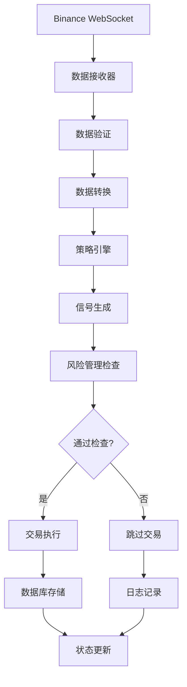
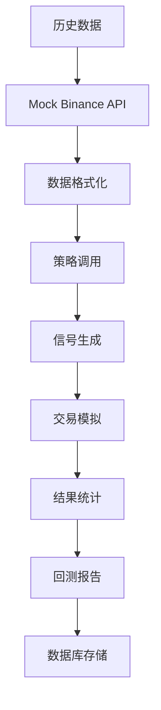
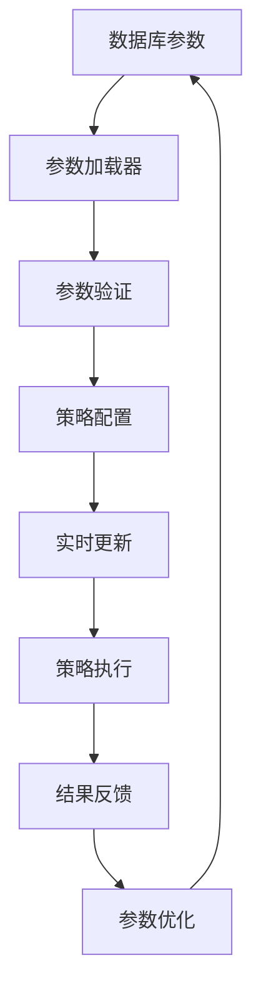
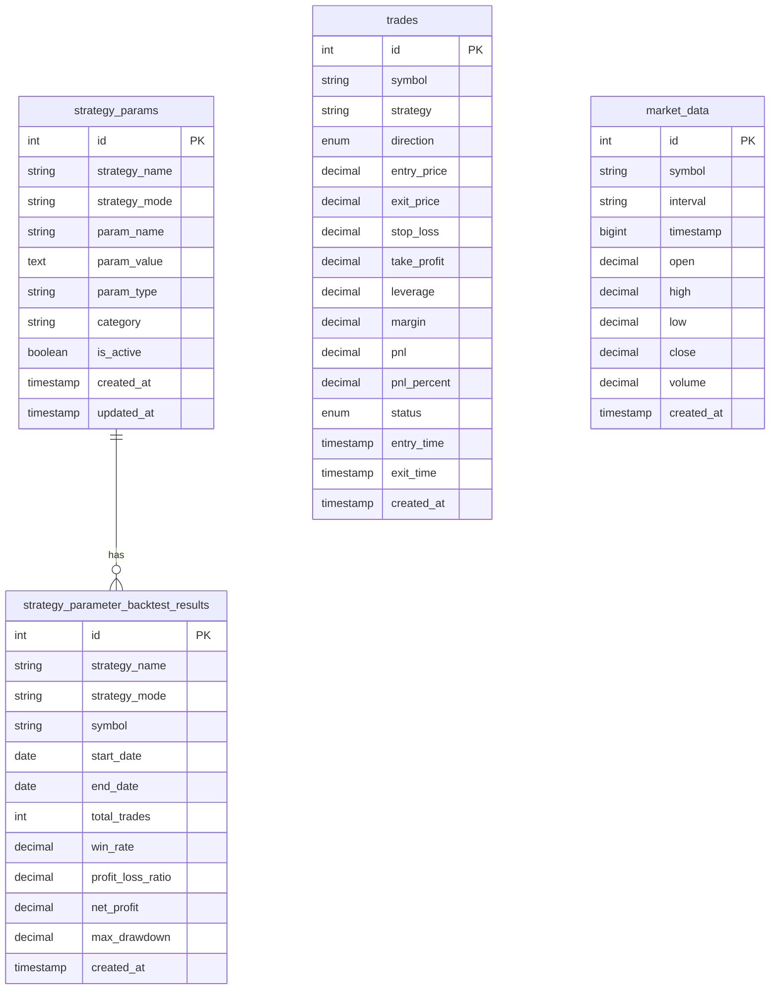

# SmartFlow 数据流架构文档

## 📋 数据流概览

本文档详细描述了SmartFlow系统的数据流架构，包括实时数据流、回测数据流、参数管理流等核心数据流程。

---

## 🔄 核心数据流

### 1. 实时交易数据流



#### 详细流程说明

1. **数据接收** (Binance WebSocket)
   ```javascript
   // WebSocket连接管理
   const ws = new WebSocket('wss://stream.binance.com:9443/ws/btcusdt@ticker');
   ws.on('message', (data) => {
     const ticker = JSON.parse(data);
     processTickerData(ticker);
   });
   ```

2. **数据验证** (数据完整性检查)
   ```javascript
   function validateTickerData(ticker) {
     return ticker && 
            ticker.symbol && 
            ticker.price && 
            ticker.timestamp;
   }
   ```

3. **数据转换** (标准化处理)
   ```javascript
   function transformTickerData(ticker) {
     return {
       symbol: ticker.symbol,
       price: parseFloat(ticker.price),
       timestamp: ticker.timestamp,
       volume: parseFloat(ticker.volume),
       change: parseFloat(ticker.priceChange)
     };
   }
   ```

4. **策略执行** (ICT/V3策略)
   ```javascript
   async function executeStrategy(symbol, data) {
     const ictResult = await ictStrategy.execute(symbol, data);
     const v3Result = await v3Strategy.execute(symbol, data);
     return { ict: ictResult, v3: v3Result };
   }
   ```

5. **风险管理** (回撤控制)
   ```javascript
   function checkRiskManagement(strategy, signal) {
     const currentDrawdown = (strategy.peakEquity - strategy.currentEquity) / strategy.peakEquity;
     if (currentDrawdown > strategy.maxDrawdownLimit) {
       return { allowed: false, reason: 'Drawdown limit exceeded' };
     }
     return { allowed: true };
   }
   ```

### 2. 回测数据流



#### 详细流程说明

1. **历史数据获取**
   ```javascript
   // 从数据库获取历史K线数据
   async function getHistoricalData(symbol, startDate, endDate, interval) {
     const query = `
       SELECT * FROM market_data 
       WHERE symbol = ? AND interval = ? 
       AND timestamp BETWEEN ? AND ?
       ORDER BY timestamp
     `;
     return await db.query(query, [symbol, interval, startDate, endDate]);
   }
   ```

2. **Mock API封装**
   ```javascript
   class MockBinanceAPI {
     constructor(marketData) {
       this.marketData = marketData;
     }
     
     async getKlines(symbol, interval, limit = 500) {
       return this.marketData[symbol]?.[interval] || [];
     }
     
     async getTicker(symbol) {
       const klines = this.marketData[symbol]?.['1m'] || [];
       const latest = klines[klines.length - 1];
       return {
         symbol: symbol,
         price: latest[4],
         timestamp: latest[0]
       };
     }
   }
   ```

3. **策略调用**
   ```javascript
   async function executeBacktest(strategy, data, params) {
     // 注入Mock API到策略
     strategy.binanceAPI = mockAPI;
     
     // 执行策略
     const result = await strategy.execute(symbol, data, params);
     return result;
   }
   ```

4. **交易模拟**
   ```javascript
   function simulateTrade(position, signal, currentPrice) {
     if (signal === 'BUY' || signal === 'SELL') {
       // 开仓逻辑
       const direction = signal === 'BUY' ? 'LONG' : 'SHORT';
       const entryPrice = currentPrice;
       const stopLoss = calculateStopLoss(direction, entryPrice);
       const takeProfit = calculateTakeProfit(direction, entryPrice, stopLoss);
       
       return {
         direction,
         entryPrice,
         stopLoss,
         takeProfit,
         timestamp: Date.now()
       };
     }
     return null;
   }
   ```

5. **结果统计**
   ```javascript
   function calculateBacktestResults(trades) {
     const totalTrades = trades.length;
     const winningTrades = trades.filter(t => t.pnl > 0);
     const winRate = (winningTrades.length / totalTrades) * 100;
     
     const totalPnl = trades.reduce((sum, t) => sum + t.pnl, 0);
     const avgWin = winningTrades.reduce((sum, t) => sum + t.pnl, 0) / winningTrades.length;
     const avgLoss = trades.filter(t => t.pnl < 0).reduce((sum, t) => sum + t.pnl, 0) / (totalTrades - winningTrades.length);
     const profitLossRatio = Math.abs(avgWin / avgLoss);
     
     return {
       totalTrades,
       winRate,
       totalPnl,
       profitLossRatio,
       maxDrawdown: calculateMaxDrawdown(trades)
     };
   }
   ```

### 3. 参数管理数据流



#### 详细流程说明

1. **参数加载**
   ```javascript
   class StrategyParameterLoader {
     async loadParameters(strategyName, mode) {
       const query = `
         SELECT param_name, param_value, param_type 
         FROM strategy_params 
         WHERE strategy_name = ? AND strategy_mode = ? AND is_active = 1
       `;
       const params = await db.query(query, [strategyName, mode]);
       return this.parseParameters(params);
     }
     
     parseParameters(params) {
       const result = {};
       params.forEach(param => {
         const value = this.convertValue(param.param_value, param.param_type);
         result[param.param_name] = value;
       });
       return result;
     }
   }
   ```

2. **参数验证**
   ```javascript
   function validateParameters(params, schema) {
     const errors = [];
     for (const [key, value] of Object.entries(params)) {
       const rule = schema[key];
       if (rule) {
         if (rule.min && value < rule.min) {
           errors.push(`${key} must be >= ${rule.min}`);
         }
         if (rule.max && value > rule.max) {
           errors.push(`${key} must be <= ${rule.max}`);
         }
       }
     }
     return errors;
   }
   ```

3. **策略配置**
   ```javascript
   class StrategyConfig {
     constructor(parameters) {
       this.parameters = parameters;
       this.lastUpdated = Date.now();
     }
     
     getParameter(name, defaultValue) {
       return this.parameters[name] || defaultValue;
     }
     
     updateParameters(newParams) {
       this.parameters = { ...this.parameters, ...newParams };
       this.lastUpdated = Date.now();
     }
   }
   ```

---

## 📊 数据存储架构

### 1. 数据库表关系



### 2. 数据流存储

#### 实时数据存储
```javascript
// 实时数据存储流程
async function storeRealTimeData(ticker) {
  // 1. 更新最新价格
  await updateLatestPrice(ticker);
  
  // 2. 存储K线数据
  await storeKlineData(ticker);
  
  // 3. 更新技术指标
  await updateTechnicalIndicators(ticker);
  
  // 4. 触发策略检查
  await triggerStrategyCheck(ticker);
}
```

#### 回测数据存储
```javascript
// 回测结果存储
async function storeBacktestResults(results) {
  const query = `
    INSERT INTO strategy_parameter_backtest_results 
    (strategy_name, strategy_mode, symbol, start_date, end_date, 
     total_trades, win_rate, profit_loss_ratio, net_profit, max_drawdown)
    VALUES (?, ?, ?, ?, ?, ?, ?, ?, ?, ?)
  `;
  
  await db.query(query, [
    results.strategyName,
    results.strategyMode,
    results.symbol,
    results.startDate,
    results.endDate,
    results.totalTrades,
    results.winRate,
    results.profitLossRatio,
    results.netProfit,
    results.maxDrawdown
  ]);
}
```

---

## 🔄 数据同步机制

### 1. 实时数据同步

```javascript
// WebSocket数据同步
class RealTimeDataSync {
  constructor() {
    this.connections = new Map();
    this.dataBuffer = new Map();
  }
  
  async syncData(symbol, data) {
    // 1. 更新本地缓存
    this.dataBuffer.set(symbol, data);
    
    // 2. 通知所有连接的客户端
    this.notifyClients(symbol, data);
    
    // 3. 触发策略检查
    await this.triggerStrategyCheck(symbol, data);
  }
  
  notifyClients(symbol, data) {
    this.connections.forEach((ws, clientId) => {
      if (ws.readyState === WebSocket.OPEN) {
        ws.send(JSON.stringify({
          type: 'price_update',
          symbol: symbol,
          data: data
        }));
      }
    });
  }
}
```

### 2. 历史数据同步

```javascript
// 历史数据同步
class HistoricalDataSync {
  async syncHistoricalData(symbol, interval, startDate, endDate) {
    // 1. 从Binance API获取数据
    const binanceData = await this.fetchFromBinance(symbol, interval, startDate, endDate);
    
    // 2. 数据转换和验证
    const processedData = await this.processData(binanceData);
    
    // 3. 存储到数据库
    await this.storeToDatabase(processedData);
    
    // 4. 更新缓存
    await this.updateCache(processedData);
  }
}
```

---

## 📈 性能优化

### 1. 数据缓存策略

```javascript
// Redis缓存策略
class DataCache {
  constructor(redisClient) {
    this.redis = redisClient;
  }
  
  async cacheTickerData(symbol, data) {
    const key = `ticker:${symbol}`;
    await this.redis.setex(key, 60, JSON.stringify(data)); // 60秒过期
  }
  
  async getCachedTickerData(symbol) {
    const key = `ticker:${symbol}`;
    const data = await this.redis.get(key);
    return data ? JSON.parse(data) : null;
  }
}
```

### 2. 数据压缩

```javascript
// 数据压缩
class DataCompression {
  compressKlineData(klines) {
    return klines.map(kline => [
      kline[0], // timestamp
      parseFloat(kline[1]), // open
      parseFloat(kline[2]), // high
      parseFloat(kline[3]), // low
      parseFloat(kline[4]), // close
      parseFloat(kline[5])  // volume
    ]);
  }
  
  decompressKlineData(compressedData) {
    return compressedData.map(kline => [
      kline[0].toString(),
      kline[1].toString(),
      kline[2].toString(),
      kline[3].toString(),
      kline[4].toString(),
      kline[5].toString()
    ]);
  }
}
```

### 3. 批量处理

```javascript
// 批量数据处理
class BatchProcessor {
  constructor(batchSize = 100) {
    this.batchSize = batchSize;
    this.buffer = [];
  }
  
  async addData(data) {
    this.buffer.push(data);
    
    if (this.buffer.length >= this.batchSize) {
      await this.processBatch();
    }
  }
  
  async processBatch() {
    if (this.buffer.length === 0) return;
    
    const batch = this.buffer.splice(0, this.batchSize);
    await this.processDataBatch(batch);
  }
}
```

---

## 🔧 错误处理

### 1. 数据验证错误

```javascript
// 数据验证错误处理
class DataValidationError extends Error {
  constructor(message, data) {
    super(message);
    this.name = 'DataValidationError';
    this.data = data;
  }
}

function validateTickerData(ticker) {
  if (!ticker.symbol) {
    throw new DataValidationError('Missing symbol', ticker);
  }
  if (!ticker.price || isNaN(ticker.price)) {
    throw new DataValidationError('Invalid price', ticker);
  }
  return true;
}
```

### 2. 网络错误处理

```javascript
// 网络错误处理
class NetworkErrorHandler {
  constructor() {
    this.retryCount = 0;
    this.maxRetries = 3;
  }
  
  async handleNetworkError(error, operation) {
    if (this.retryCount < this.maxRetries) {
      this.retryCount++;
      console.log(`Retrying operation ${operation} (${this.retryCount}/${this.maxRetries})`);
      await this.delay(1000 * this.retryCount);
      return await this.retryOperation(operation);
    } else {
      throw new Error(`Max retries exceeded for operation: ${operation}`);
    }
  }
}
```

---

## 📋 数据流监控

### 1. 数据流指标

```javascript
// 数据流监控指标
class DataFlowMetrics {
  constructor() {
    this.metrics = {
      dataReceived: 0,
      dataProcessed: 0,
      dataErrors: 0,
      processingTime: 0
    };
  }
  
  recordDataReceived() {
    this.metrics.dataReceived++;
  }
  
  recordDataProcessed(processingTime) {
    this.metrics.dataProcessed++;
    this.metrics.processingTime += processingTime;
  }
  
  recordDataError() {
    this.metrics.dataErrors++;
  }
  
  getMetrics() {
    return {
      ...this.metrics,
      errorRate: this.metrics.dataErrors / this.metrics.dataReceived,
      avgProcessingTime: this.metrics.processingTime / this.metrics.dataProcessed
    };
  }
}
```

### 2. 性能监控

```javascript
// 性能监控
class PerformanceMonitor {
  constructor() {
    this.startTime = Date.now();
    this.operations = [];
  }
  
  startOperation(operationName) {
    return {
      name: operationName,
      startTime: Date.now()
    };
  }
  
  endOperation(operation) {
    const duration = Date.now() - operation.startTime;
    this.operations.push({
      name: operation.name,
      duration: duration
    });
    return duration;
  }
  
  getPerformanceReport() {
    const totalTime = Date.now() - this.startTime;
    const avgOperationTime = this.operations.reduce((sum, op) => sum + op.duration, 0) / this.operations.length;
    
    return {
      totalTime,
      operationCount: this.operations.length,
      avgOperationTime,
      slowestOperation: this.operations.reduce((max, op) => op.duration > max.duration ? op : max, { duration: 0 })
    };
  }
}
```

---

## 🔗 相关链接

- **系统架构文档**: /docs/architecture/SYSTEM_ARCHITECTURE_V2.1.md
- **API文档**: /docs/api/
- **部署文档**: /docs/deployment/

---

*文档版本: v2.1*
*最后更新: 2025-10-24*
*更新内容: 数据流架构优化，性能监控完善，错误处理机制*
