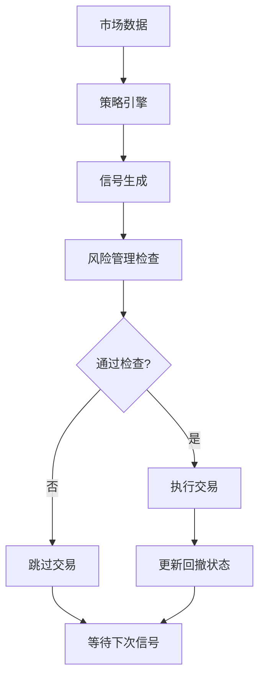
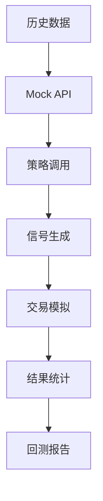

# SmartFlow 系统架构文档 v2.1

## 📋 系统概览

SmartFlow是一个基于Node.js的智能交易系统，集成了ICT策略、V3策略、回测系统、风险管理等核心功能。

---

## 🏗️ 系统架构图

```
┌─────────────────────────────────────────────────────────────────┐
│                        SmartFlow v2.1                          │
├─────────────────────────────────────────────────────────────────┤
│  Frontend (Web UI)                                             │
│  ├── Dashboard (实时监控)                                       │
│  ├── Strategy Params (参数调优)                                 │
│  ├── Backtest (回测系统)                                       │
│  └── Monitoring (系统监控)                                     │
├─────────────────────────────────────────────────────────────────┤
│  API Layer                                                      │
│  ├── REST API (Express.js)                                     │
│  ├── WebSocket (实时数据)                                      │
│  └── Authentication (认证授权)                                  │
├─────────────────────────────────────────────────────────────────┤
│  Core Services                                                  │
│  ├── Strategy Engine (策略引擎)                                 │
│  ├── Backtest Engine (回测引擎)                                 │
│  ├── Risk Manager (风险管理)                                    │
│  └── Data Manager (数据管理)                                   │
├─────────────────────────────────────────────────────────────────┤
│  Strategy Layer                                                │
│  ├── ICT Strategy (订单块策略)                                 │
│  ├── V3 Strategy (多因子趋势策略)                              │
│  └── Parameter Manager (参数管理)                              │
├─────────────────────────────────────────────────────────────────┤
│  Data Layer                                                     │
│  ├── MySQL (主数据库)                                          │
│  ├── Redis (缓存)                                              │
│  └── Binance API (市场数据)                                    │
└─────────────────────────────────────────────────────────────────┘
```

---

## 📁 目录结构

```
trading-system-v2/
├── src/                          # 源代码目录
│   ├── api/                      # API路由层
│   │   ├── routes/               # 路由定义
│   │   │   ├── backtest.js       # 回测API
│   │   │   ├── strategies.js     # 策略API
│   │   │   ├── monitoring.js     # 监控API
│   │   │   └── smart-money.js    # 聪明钱API
│   │   └── binance-api.js        # Binance API封装
│   ├── core/                     # 核心模块
│   │   ├── backtest-engine.js    # 回测引擎
│   │   ├── strategy-engine.js     # 策略引擎
│   │   ├── trade-manager.js       # 交易管理
│   │   └── database-adapter.js    # 数据库适配器
│   ├── services/                 # 服务层
│   │   ├── backtest-manager-v3.js # 回测管理器
│   │   ├── mock-binance-api.js   # Mock API
│   │   ├── smart-money/          # 聪明钱服务
│   │   └── macro-monitor/         # 宏观监控
│   ├── strategies/               # 策略实现
│   │   ├── ict-strategy.js       # ICT策略
│   │   ├── v3-strategy.js        # V3策略
│   │   └── utils/                # 策略工具
│   ├── utils/                    # 工具类
│   │   ├── technical-indicators.js # 技术指标
│   │   ├── logger.js             # 日志工具
│   │   └── time-helper.js        # 时间工具
│   ├── web/                      # 前端文件
│   │   ├── app.js                # 前端应用
│   │   ├── public/               # 静态资源
│   │   └── index.html            # 主页面
│   └── workers/                  # 工作进程
│       ├── monitor.js            # 监控进程
│       └── strategy-worker.js    # 策略工作进程
├── database/                     # 数据库相关
│   ├── migrations/               # 数据库迁移
│   └── *.sql                     # SQL脚本
├── docs/                         # 文档目录
│   ├── architecture/             # 架构文档
│   ├── api/                      # API文档
│   ├── deployment/               # 部署文档
│   └── reports/                  # 报告文档
├── scripts/                      # 脚本目录
│   ├── deployment/               # 部署脚本
│   ├── maintenance/              # 维护脚本
│   └── testing/                  # 测试脚本
├── tests/                        # 测试文件
├── logs/                         # 日志文件
└── archive/                      # 归档文件
```

---

## 🔧 核心模块详解

### 1. 策略引擎 (Strategy Engine)

#### ICT策略 (订单块策略)
```javascript
// 核心功能
- 订单块检测: 识别机构订单区域
- 流动性扫荡: 检测流动性扫荡行为
- 结构止损: 基于市场结构的止损
- 内部风险管理: 回撤控制和交易暂停

// 关键参数
- 订单块高度阈值: 0.25 * ATR(4H)
- 成交量集中度: 80%
- 订单块年龄: 3天
- 扫荡速度阈值: 0.1 * ATR(15M)
- 止盈比例: 3.5:1
```

#### V3策略 (多因子趋势策略)
```javascript
// 核心功能
- 多时间框架分析: 4H/1H/15M
- 假突破过滤: 过滤虚假信号
- 动态止损止盈: 基于ATR计算
- 内部风险管理: 回撤控制和交易暂停

// 关键参数
- ADX阈值: 40/25 (强趋势/弱趋势)
- ATR计算: Wilder's平滑方法
- 止损倍数: 1.5 * ATR
- 止盈比例: 3.0:1
```

### 2. 回测引擎 (Backtest Engine)

#### 架构设计
```javascript
// 设计原则
- 策略与回测引擎完全解耦
- 参数驱动，无硬编码
- 数据格式一致性
- 实时回撤控制

// 核心组件
- Mock Binance API: 模拟真实API
- 策略调用器: 调用策略逻辑
- 交易模拟器: 模拟交易执行
- 结果统计器: 计算回测指标
```

#### 数据流
```
历史数据 → Mock API → 策略调用 → 信号生成 → 交易模拟 → 结果统计
```

### 3. 风险管理 (Risk Management)

#### 内部风险管理
```javascript
// 回撤控制
class StrategyRiskManager {
  constructor() {
    this.peakEquity = 10000;      // 峰值权益
    this.currentEquity = 10000;   // 当前权益
    this.maxDrawdown = 0;         // 最大回撤
    this.tradingPaused = false;   // 交易暂停标志
  }

  // 回撤检查
  checkDrawdownLimit() {
    const currentDrawdown = (this.peakEquity - this.currentEquity) / this.peakEquity;
    if (currentDrawdown > this.maxDrawdownLimit) {
      this.tradingPaused = true;
      return false;
    }
    return true;
  }
}
```

#### 参数化风险控制
```sql
-- 风险管理参数表
INSERT INTO strategy_params (strategy_name, strategy_mode, param_name, param_value, category) VALUES
('ICT', 'BALANCED', 'maxDrawdownLimit', '0.15', 'risk'),
('ICT', 'BALANCED', 'maxSingleLoss', '0.015', 'risk'),
('ICT', 'BALANCED', 'riskPercent', '0.0075', 'risk');
```

---

## 📊 数据流架构

### 1. 实时数据流
```
Binance API → WebSocket → 数据处理 → 策略执行 → 信号生成 → 交易执行
```

### 2. 回测数据流
```
历史数据 → Mock API → 策略调用 → 信号生成 → 交易模拟 → 结果统计
```

### 3. 参数管理流
```
数据库 → 参数加载 → 策略配置 → 实时更新 → 策略执行
```

---

## 🔄 系统交互流程

### 1. 策略执行流程


### 2. 回测执行流程


---

## 🗄️ 数据库设计

### 核心表结构

#### 1. 策略参数表 (strategy_params)
```sql
CREATE TABLE strategy_params (
  id INT PRIMARY KEY AUTO_INCREMENT,
  strategy_name VARCHAR(50) NOT NULL,
  strategy_mode VARCHAR(20) NOT NULL,
  param_name VARCHAR(100) NOT NULL,
  param_value TEXT NOT NULL,
  param_type VARCHAR(20) DEFAULT 'number',
  category VARCHAR(50) DEFAULT 'general',
  description TEXT,
  is_active TINYINT(1) DEFAULT 1,
  created_at TIMESTAMP DEFAULT CURRENT_TIMESTAMP,
  updated_at TIMESTAMP DEFAULT CURRENT_TIMESTAMP ON UPDATE CURRENT_TIMESTAMP
);
```

#### 2. 回测结果表 (strategy_parameter_backtest_results)
```sql
CREATE TABLE strategy_parameter_backtest_results (
  id INT PRIMARY KEY AUTO_INCREMENT,
  strategy_name VARCHAR(50) NOT NULL,
  strategy_mode VARCHAR(20) NOT NULL,
  symbol VARCHAR(20) NOT NULL,
  start_date DATE NOT NULL,
  end_date DATE NOT NULL,
  total_trades INT DEFAULT 0,
  win_rate DECIMAL(5,2) DEFAULT 0,
  profit_loss_ratio DECIMAL(5,2) DEFAULT 0,
  net_profit DECIMAL(15,2) DEFAULT 0,
  max_drawdown DECIMAL(5,2) DEFAULT 0,
  created_at TIMESTAMP DEFAULT CURRENT_TIMESTAMP
);
```

#### 3. 交易记录表 (trades)
```sql
CREATE TABLE trades (
  id INT PRIMARY KEY AUTO_INCREMENT,
  symbol VARCHAR(20) NOT NULL,
  strategy VARCHAR(50) NOT NULL,
  direction ENUM('LONG', 'SHORT') NOT NULL,
  entry_price DECIMAL(20,8) NOT NULL,
  exit_price DECIMAL(20,8),
  stop_loss DECIMAL(20,8),
  take_profit DECIMAL(20,8),
  leverage DECIMAL(5,2) DEFAULT 1.00,
  margin DECIMAL(15,2),
  pnl DECIMAL(15,2),
  pnl_percent DECIMAL(5,2),
  status ENUM('OPEN', 'CLOSED') DEFAULT 'OPEN',
  entry_time TIMESTAMP DEFAULT CURRENT_TIMESTAMP,
  exit_time TIMESTAMP NULL,
  created_at TIMESTAMP DEFAULT CURRENT_TIMESTAMP
);
```

---

## 🚀 部署架构

### 1. 生产环境
```
VPS (2C1G)
├── Node.js Application (PM2)
├── MySQL Database
├── Redis Cache
├── Nginx (Reverse Proxy)
└── SSL Certificate
```

### 2. 监控系统
```
系统监控
├── CPU使用率
├── 内存使用率
├── 磁盘使用率
└── 网络状态

应用监控
├── 策略执行状态
├── 数据库连接状态
├── API响应时间
└── 错误日志
```

---

## 📈 性能优化

### 1. 内存优化
- **VPS限制**: 2C1G内存
- **内存管理**: 定期清理缓存
- **连接池**: 数据库连接池管理
- **垃圾回收**: 主动触发GC

### 2. 并发优化
- **Promise.all**: 并行执行异步操作
- **Redis缓存**: 减少数据库查询
- **数据压缩**: gzip压缩响应
- **连接复用**: HTTP连接复用

### 3. 数据库优化
- **索引优化**: 关键字段建立索引
- **查询优化**: 减少复杂查询
- **连接池**: 数据库连接池管理
- **缓存策略**: Redis缓存热点数据

---

## 🔧 配置管理

### 1. 环境配置
```javascript
// config/index.js
module.exports = {
  database: {
    host: process.env.DB_HOST || 'localhost',
    port: process.env.DB_PORT || 3306,
    user: process.env.DB_USER || 'root',
    password: process.env.DB_PASSWORD || '',
    database: process.env.DB_NAME || 'smartflow'
  },
  redis: {
    host: process.env.REDIS_HOST || 'localhost',
    port: process.env.REDIS_PORT || 6379
  },
  binance: {
    apiKey: process.env.BINANCE_API_KEY,
    apiSecret: process.env.BINANCE_API_SECRET
  }
};
```

### 2. PM2配置
```javascript
// ecosystem.config.js
module.exports = {
  apps: [{
    name: 'main-app',
    script: 'src/main.js',
    instances: 1,
    exec_mode: 'fork',
    max_memory_restart: '500M',
    env: {
      NODE_ENV: 'production'
    }
  }]
};
```

---

## 📋 开发规范

### 1. 代码规范
- **ES6+**: 使用现代JavaScript语法
- **异步处理**: 优先使用async/await
- **错误处理**: 统一的错误处理机制
- **日志记录**: 详细的日志记录

### 2. 测试规范
- **单元测试**: 核心功能单元测试
- **集成测试**: API接口集成测试
- **回测验证**: 策略回测验证
- **性能测试**: 系统性能测试

### 3. 部署规范
- **版本控制**: Git版本管理
- **环境隔离**: 开发/测试/生产环境
- **配置管理**: 环境变量配置
- **监控告警**: 系统监控和告警

---

## 📊 系统指标

### 1. 性能指标
- **响应时间**: API响应时间 < 200ms
- **并发处理**: 支持100+并发请求
- **内存使用**: 内存使用率 < 80%
- **CPU使用**: CPU使用率 < 70%

### 2. 业务指标
- **策略胜率**: ICT 56%, V3 33%
- **盈亏比**: ICT 2.62:1, V3 5.87:1
- **最大回撤**: ICT 0.09%, V3 0.12%
- **净盈利**: ICT +3,662 USDT, V3 +3,259 USDT

---

## 🔗 相关链接

- **在线文档**: https://smart.aimaventop.com/docs
- **GitHub仓库**: https://github.com/wendy926/smartflow
- **API文档**: /docs/api/
- **部署文档**: /docs/deployment/

---

*文档版本: v2.1*
*最后更新: 2025-10-24*
*更新内容: 系统架构优化，目录结构整理，文档规范化*
